# Fundamentos Spring Boot

## Autor

Domenica Uyunkar

## Descripción

Proyecto desarrollado con Spring Boot para implementar una API REST.  
Durante las prácticas se trabajó con controladores, servicios, DTOs, validaciones, persistencia con PostgreSQL y manejo global de errores.

## Requisitos

* Java 21
* Gradle
* Spring Boot
* PostgreSQL
* Docker
* Visual Studio Code
* Postman

## Ejecución

```bash
.\gradlew.bat bootRun
```

El servidor se ejecuta en el puerto 8080.

---

# Práctica 1: Configuración inicial del proyecto

## Descripción

En esta práctica se verificó la instalación y funcionamiento inicial del proyecto Spring Boot.

Se comprobó la versión de Java, el inicio correcto del servidor Tomcat y el funcionamiento de un endpoint de estado.

## Endpoint probado

```http
GET /api/status
```

URL utilizada:

```text
http://localhost:8080/api/status
```

## Evidencias

### Evidencia 1: Versión de Java


### Evidencia 2: Inicio de Tomcat


### Evidencia 3: Endpoint de estado funcionando


### Evidencia 4: Controlador de estado creado


## Conclusión

La aplicación Spring Boot se ejecutó correctamente y el endpoint de estado permitió comprobar que el servicio estaba activo.

---

# Práctica 2: Endpoint de estudiantes

## Descripción

En esta práctica se creó un endpoint REST para consultar una lista de estudiantes de prueba.

Se implementó un modelo `Student` y un controlador encargado de devolver los datos en formato JSON.

## Endpoint probado

```http
GET /v1/students
```

URL utilizada:

```text
http://localhost:8080/v1/students
```

## Evidencias

### Evidencia 1: Endpoint de estudiantes funcionando


### Evidencia 2: Controlador de estudiantes


### Evidencia 3: Modelo Student


## Explicación

El controlador recibe la petición HTTP y devuelve una lista de estudiantes.  
El modelo `Student` representa los datos que se muestran en la respuesta, como `id`, `name` y `age`.

## Conclusión

Se comprobó el funcionamiento de un endpoint REST básico que devuelve información en formato JSON.

---

# Práctica 3: API REST CRUD de productos

## Descripción

En esta práctica se implementó un CRUD REST para productos.

Los productos se almacenaban temporalmente en memoria, es decir, en una lista dentro de la aplicación. Cada producto tenía `id`, `name`, `price`, `stock` y `createdAt`.

## Endpoints principales

| Método | Endpoint | Descripción |
| ------ | -------- | ----------- |
| GET | `/api/products` | Listar productos |
| GET | `/api/products/{id}` | Buscar producto por ID |
| POST | `/api/products` | Crear producto |
| PUT | `/api/products/{id}` | Actualizar producto |
| PATCH | `/api/products/{id}` | Actualizar parcialmente |
| DELETE | `/api/products/{id}` | Eliminar producto |

## Evidencias

### Evidencia 1: Listado de productos

```http
GET /api/products
```


### Evidencia 2: Consulta de producto existente

```http
GET /api/products/1
```


### Evidencia 3: Eliminación de producto existente

```http
DELETE /api/products/1
```


### Evidencia 4: Eliminación de producto inexistente

```http
DELETE /api/products/1
```


## Explicación

El CRUD permite crear, consultar, actualizar y eliminar productos mediante peticiones HTTP.  
En esta práctica los datos todavía no se guardaban en base de datos, por lo que se perdían al reiniciar la aplicación.

## Conclusión

Se implementó correctamente un CRUD REST básico para productos usando controladores, DTOs, modelos y mappers.

---

# Práctica 4: Servicios e inyección de dependencias

## Descripción

En esta práctica se separó la lógica de negocio del controlador.

Antes, `ProductsController` tenía la lógica del CRUD.  
Después, esa lógica pasó a `ProductServiceImpl`, mientras que el controlador solamente recibe las peticiones y delega el trabajo al servicio.

## Componentes implementados

* `ProductService`
* `ProductServiceImpl`
* `ProductsController`
* `ProductMapper`
* DTOs de creación, actualización y respuesta

## Evidencias

### Evidencia 1: ProductServiceImpl


### Evidencia 2: ProductsController delegando al servicio


## Explicación

La inyección de dependencias permite que Spring entregue automáticamente una instancia del servicio al controlador.

El controlador declara una dependencia de tipo `ProductService` y la recibe por constructor.  
Spring detecta que `ProductServiceImpl` implementa esa interfaz y lo usa como servicio.

## Diferencia con la práctica anterior

Antes, el controlador tenía la lógica del CRUD.  
Ahora, el controlador solo recibe la petición y llama al servicio.

Esto mejora la organización del proyecto y separa responsabilidades.

## Conclusión

La capa de servicios permitió organizar mejor el proyecto.  
`ProductsController` atiende las peticiones HTTP y `ProductServiceImpl` contiene la lógica de negocio.

---

# Práctica 5: Persistencia con PostgreSQL y JPA

## Descripción

En esta práctica se reemplazó el almacenamiento en memoria por una base de datos PostgreSQL.

Se implementó persistencia usando Spring Data JPA, entidades y repositorios.

## Configuración de PostgreSQL

La base de datos se ejecutó con Docker.

| Propiedad | Valor |
| --------- | ----- |
| Contenedor | `postgres-dev` |
| Base de datos | `devdb` |
| Usuario | `ups` |
| Contraseña | `ups123` |
| Puerto | `5432` |

## Componentes implementados

* `BaseEntity`
* `ProductEntity`
* `ProductRepository`
* Conexión a PostgreSQL en `application.yml`
* Eliminación lógica con el campo `deleted`

## Verificación en PostgreSQL

Para ingresar al contenedor se utilizó:

```bash
docker exec -it postgres-dev psql -U ups -d devdb
```

Para consultar productos:

```sql
SELECT id, name, price, stock, created_at, updated_at, deleted
FROM products
ORDER BY id;
```

## Evidencias

### Evidencia 1: Productos almacenados en PostgreSQL


### Evidencia 2: Tabla products creada


## Explicación

Con JPA, los productos se guardan en PostgreSQL y ya no desaparecen al reiniciar la aplicación.

`ProductEntity` representa la tabla `products`, mientras que `ProductRepository` permite guardar, buscar y actualizar registros sin escribir SQL manualmente.

La eliminación lógica permite marcar un producto como eliminado usando `deleted = true`, sin borrarlo físicamente de la base de datos.

## Conclusión

La aplicación pasó de usar datos en memoria a guardar información de forma permanente en PostgreSQL usando Spring Data JPA.

---

# Práctica 6: Validación de DTOs

## Descripción

En esta práctica se agregaron validaciones para controlar los datos recibidos por la API antes de guardarlos en PostgreSQL.

Las validaciones se aplicaron en los DTOs usando Jakarta Validation.

## Validaciones implementadas

| Campo | Validación |
| ----- | ---------- |
| `name` | Obligatorio, mínimo 3 y máximo 150 caracteres |
| `price` | Obligatorio y mayor o igual a 0 |
| `stock` | Obligatorio y mayor o igual a 0 |

Las validaciones se activan en el controlador usando:

```java
@Valid @RequestBody
```

## Evidencias

### Evidencia 1: Error al crear producto inválido

```http
POST /api/products
```

Cuerpo enviado:

```json
{
  "name": "",
  "price": -5,
  "stock": -1
}
```

La API respondió con:

```text
400 Bad Request
```

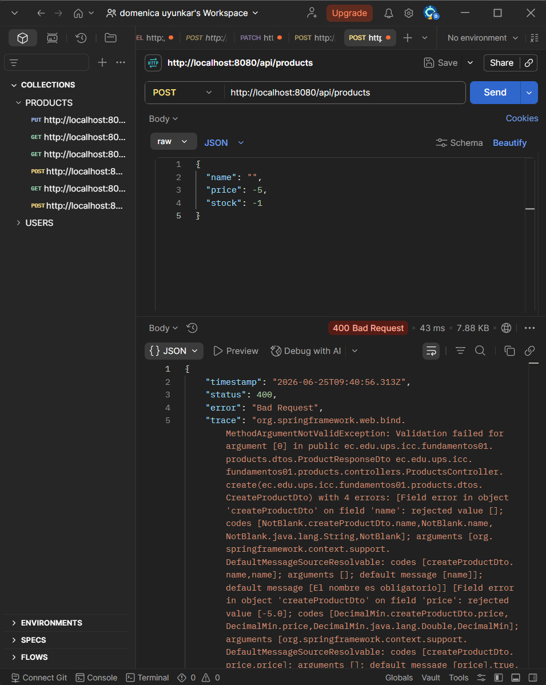

### Evidencia 2: Error al actualizar producto eliminado

```http
PUT /api/products/{id}
```

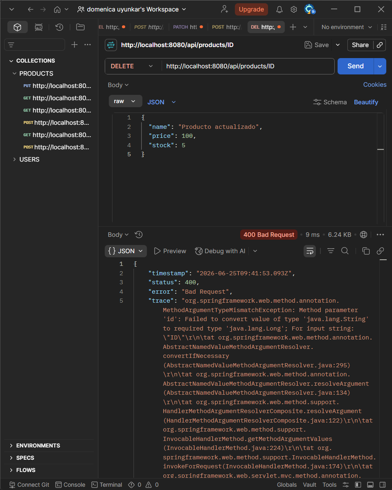

### Evidencia 3: Consulta de productos activos

```http
GET /api/products
```

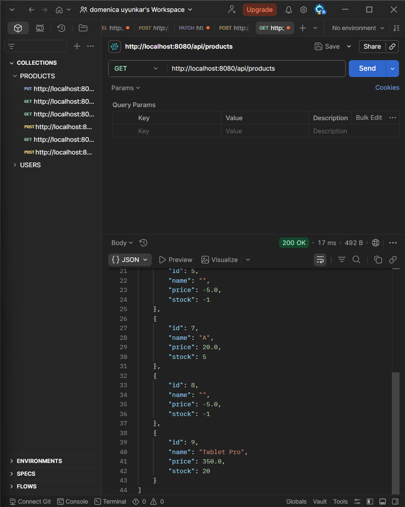

## Explicación

Las validaciones evitan que datos incorrectos lleguen al servicio o a la base de datos.

Por ejemplo, no se permite guardar productos con nombre vacío, precio negativo o stock negativo.

También se aplicaron reglas de negocio para evitar consultar, actualizar o eliminar nuevamente productos marcados como eliminados.

## Conclusión

Las validaciones permiten proteger la API frente a datos incorrectos y mejorar la calidad de la información almacenada.

---

# Práctica 7: Manejo global de errores y excepciones

## Descripción

En esta práctica se implementó un manejo global de errores para que la API devuelva respuestas uniformes y códigos HTTP correctos.

Antes, algunos errores devolvían `500 Internal Server Error`.  
Ahora se utilizan excepciones propias y `GlobalExceptionHandler`.

## Excepciones implementadas

| Excepción | Código HTTP | Uso |
| --------- | ----------- | --- |
| `NotFoundException` | 404 | Recurso no encontrado |
| `ConflictException` | 409 | Conflicto con datos existentes |
| `BadRequestException` | 400 | Solicitud inválida |

## Formato estándar de error

La API responde los errores con una estructura similar a:

```json
{
  "timestamp": "2026-06-25T05:09:04",
  "status": 404,
  "error": "Not Found",
  "message": "Product not found",
  "path": "/api/products/999"
}
```

## Evidencias

### Evidencia 1: Producto inexistente

```http
GET /api/products/999
```

La API respondió:

```text
404 Not Found
```

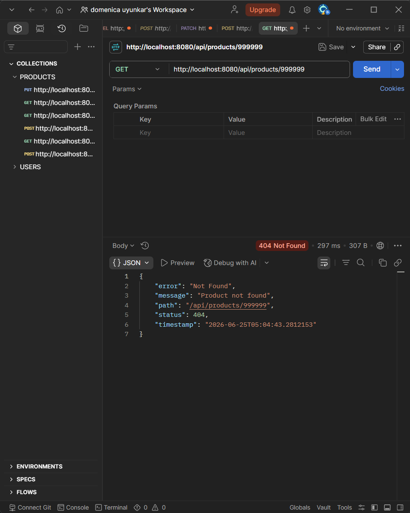

### Evidencia 2: Producto con nombre duplicado

```http
POST /api/products
```

La API respondió:

```text
409 Conflict
```

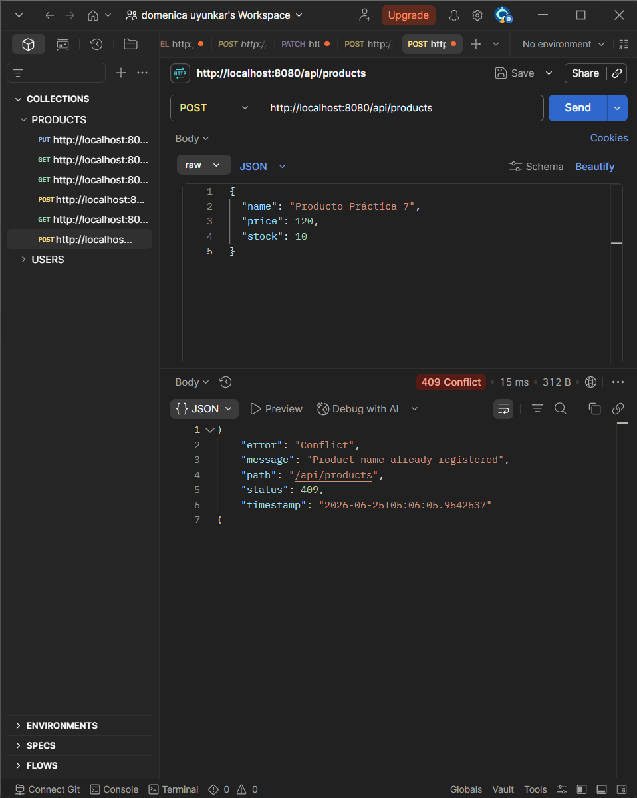

### Evidencia 3: Validación de DTO

```http
POST /api/products
```

La API respondió:

```text
400 Bad Request
```

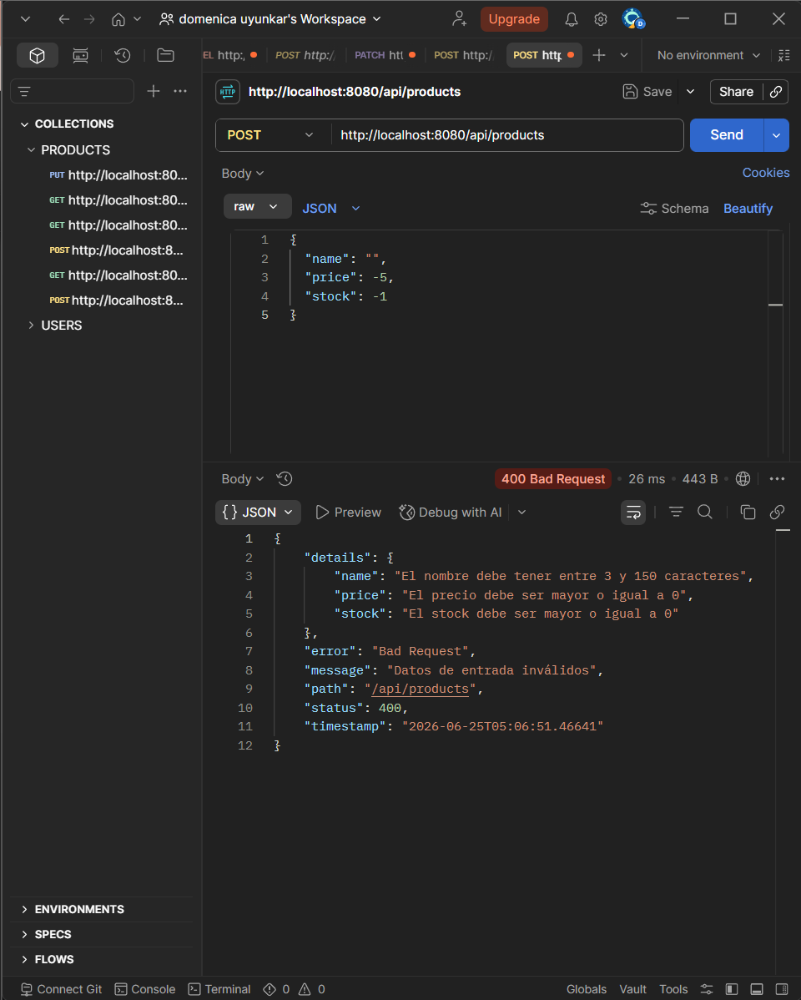

### Evidencia 4: Consulta de producto eliminado

```http
GET /api/products/{id}
```

La API respondió:

```text
404 Not Found
```

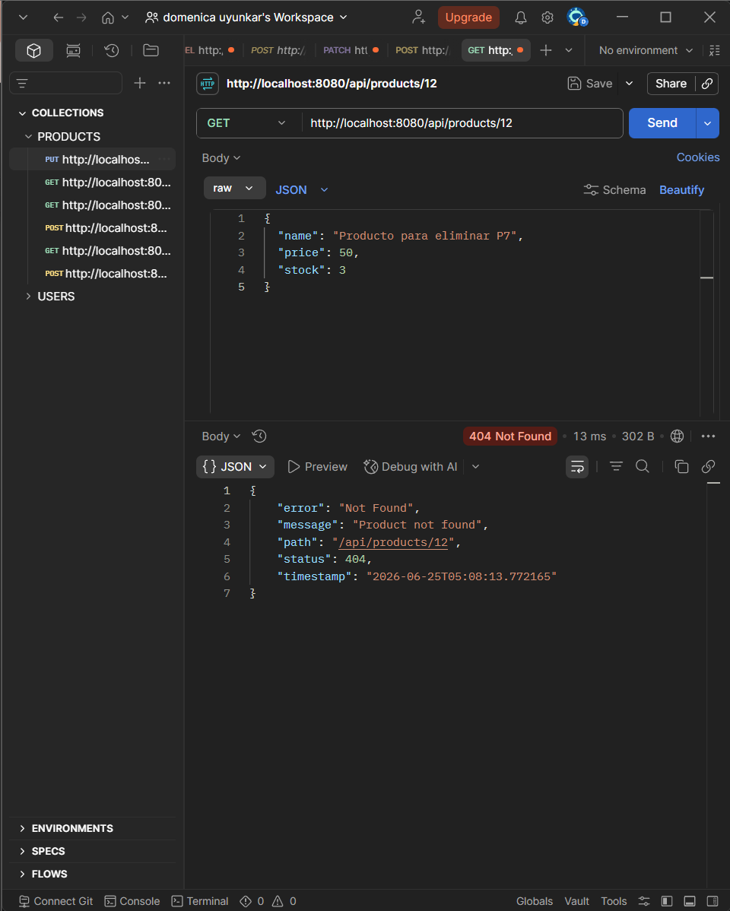

## Explicación

`GlobalExceptionHandler` centraliza el manejo de errores de toda la aplicación.

Las excepciones de dominio indican qué problema ocurrió, y el manejador global las convierte en respuestas HTTP claras, como `400`, `404` o `409`.

Esto evita mostrar errores técnicos al cliente y mantiene un formato uniforme en las respuestas.

## Conclusión

El manejo global de errores permitió mejorar la calidad de las respuestas de la API, usar códigos HTTP correctos y evitar mostrar información técnica interna.


# Práctica 8: Relaciones entre entidades JPA

## Descripción

En esta práctica se implementaron relaciones entre entidades usando Spring Data JPA y PostgreSQL.

Se relacionó `ProductEntity` con `UserEntity` y `CategoryEntity`, permitiendo que cada producto tenga un usuario propietario y una categoría asociada.

## Evidencias

### Evidencia 1: Descripción de la tabla products en PostgreSQL

Se verificó la estructura de la tabla `products` en PostgreSQL.

```sql
\d products
```

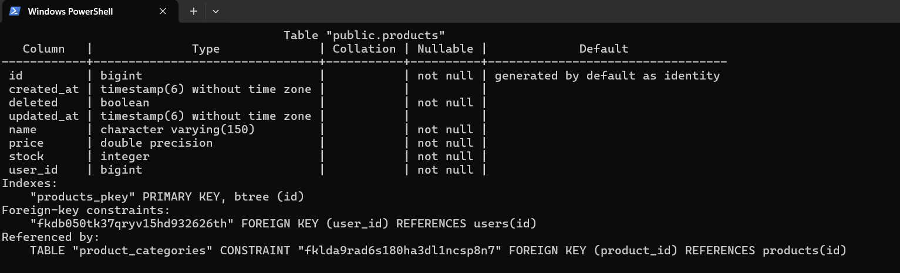

### Evidencia 2: Creación de producto con relaciones

Se realizó una petición para crear un producto relacionado con un usuario y una categoría.

```http
POST /api/products
```

La respuesta evidencia el objeto anidado `owner`, el objeto anidado `category` y los campos de fecha.

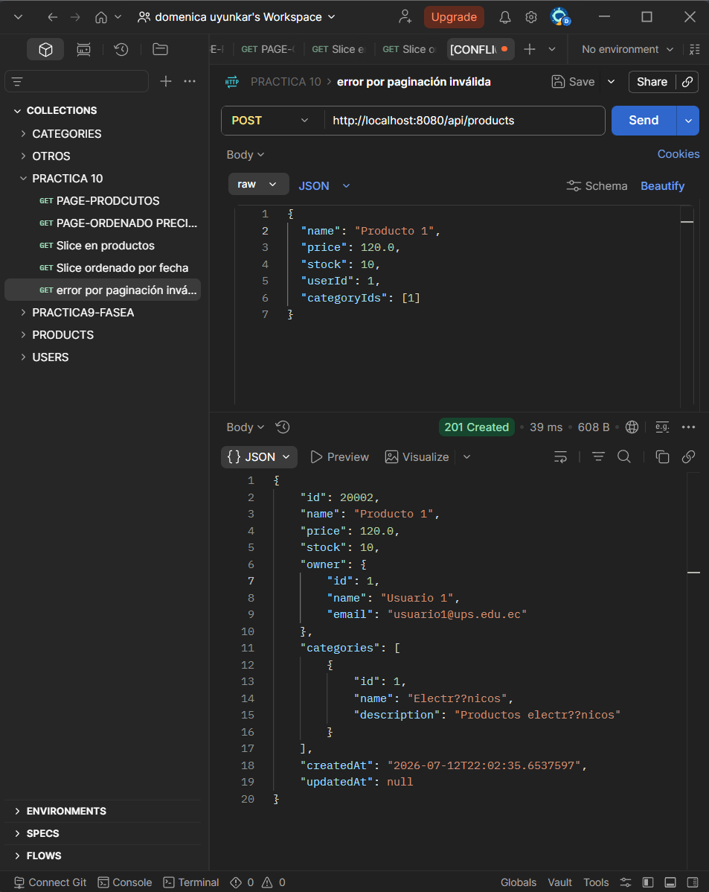

### Evidencia 3: Consulta de productos por categoría

Se realizó la consulta de productos asociados a una categoría.

```http
GET /api/products/category/1
```

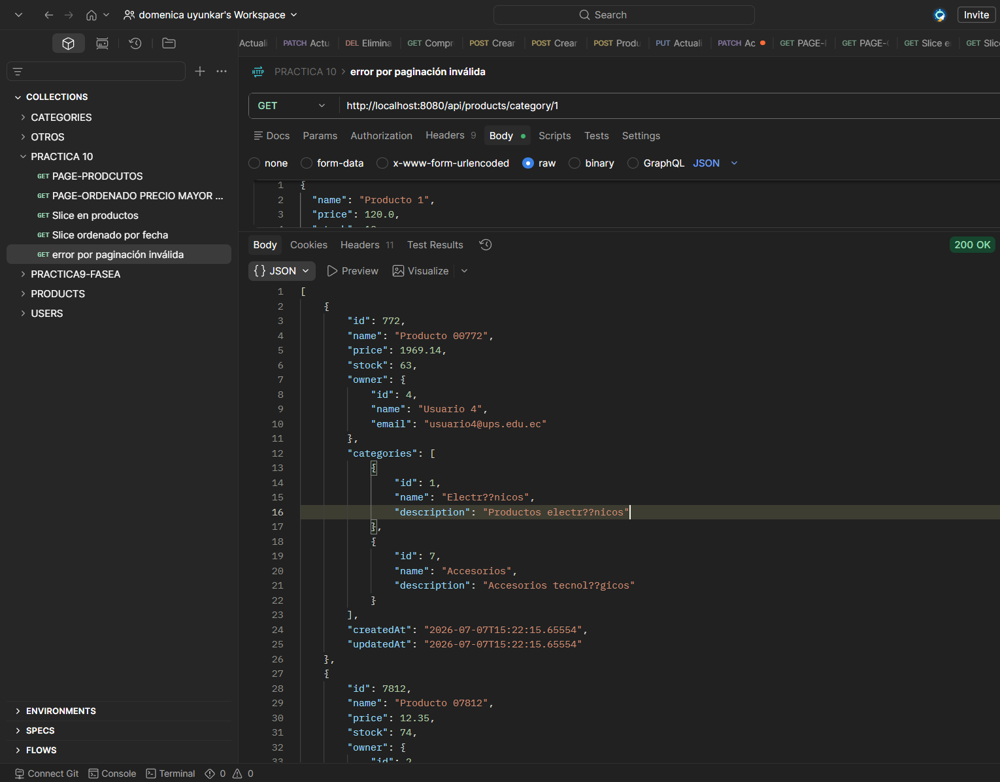

## Explicación

`ProductEntity` se relaciona con `UserEntity` usando `@ManyToOne`, porque un usuario puede tener varios productos, pero cada producto pertenece a un solo usuario. Esta relación se guarda con `@JoinColumn`, que crea la columna de referencia hacia el usuario.

También se relaciona `ProductEntity` con `CategoryEntity` usando `@ManyToOne`, porque en esta práctica cada producto pertenece a una categoría. La anotación `@JoinColumn` permite guardar en la tabla `products` el identificador de la categoría relacionada.

## Conclusión

Las relaciones JPA permiten conectar las entidades del sistema y devolver respuestas más completas. Ahora un producto puede mostrar información relacionada, como su usuario propietario y su categoría.

---

# Práctica 9: Relación ManyToMany y consultas con filtros

## Descripción

En esta práctica se actualizó la relación entre productos y categorías. Antes, un producto pertenecía a una sola categoría. Ahora, un producto puede tener varias categorías y una categoría puede estar asociada a varios productos.

También se agregaron consultas con filtros dentro de los contextos de usuarios y categorías.

## Evidencias

### Evidencia 1: Producto creado con varias categorías

Se creó un producto enviando varias categorías en el campo `categoryIds`.

```http
POST /api/products
```

Ejemplo de cuerpo:

```json
{
  "name": "Laptop Gaming",
  "price": 1200.0,
  "stock": 5,
  "userId": 1,
  "categoryIds": [1, 2, 3]
}
```

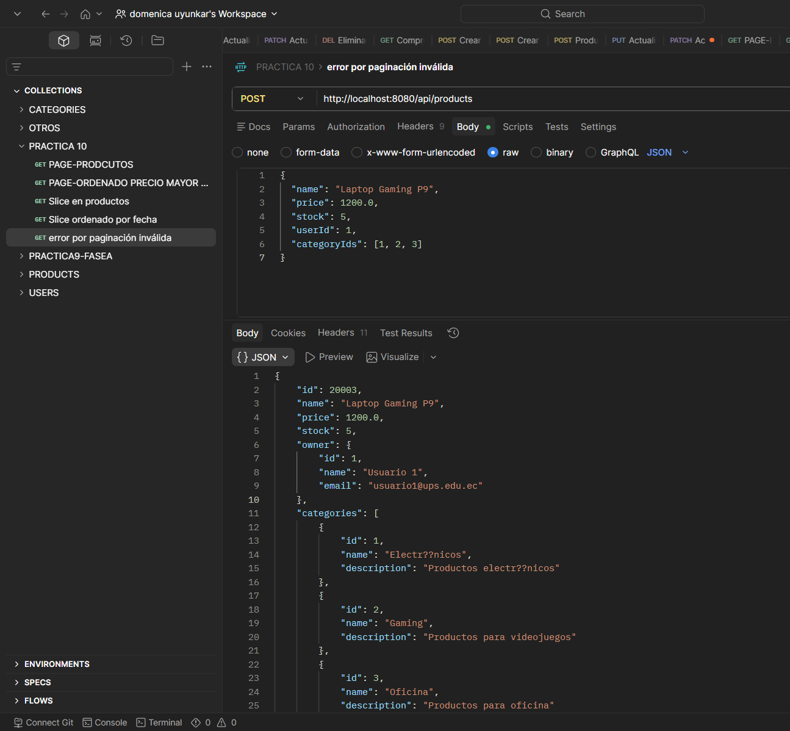

### Evidencia 2: Consulta con filtros por usuario

Se realizó una consulta de productos de un usuario aplicando filtros.

```http
GET /api/users/1/products?name=laptop&minPrice=500
```

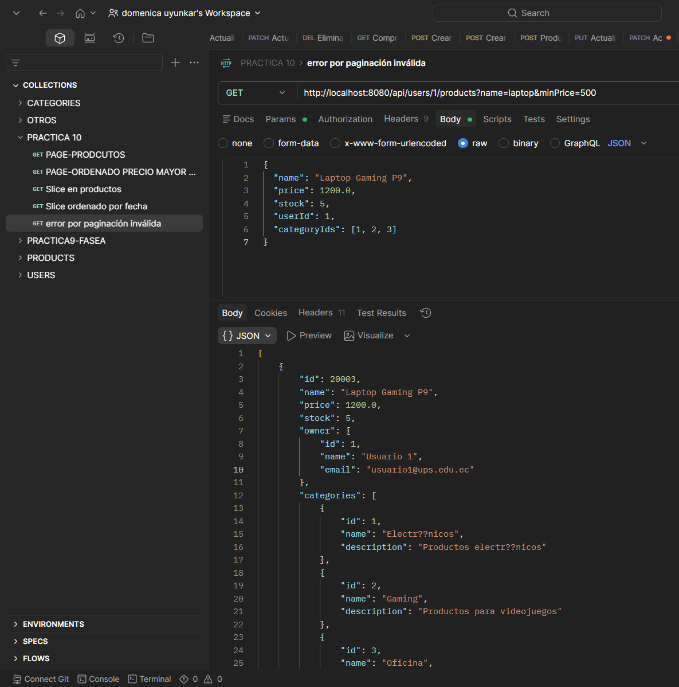

### Evidencia 3: Consulta con filtros por categoría

Se realizó una consulta de productos de una categoría aplicando filtros.

```http
GET /api/categories/2/products?userId=1
```

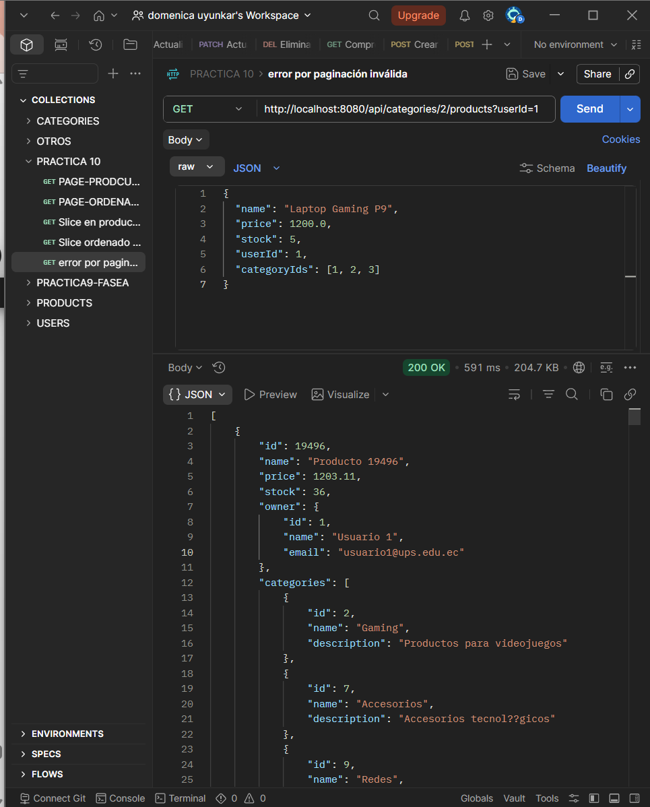

## Explicación

Aunque el endpoint esté dentro del contexto `/users/{id}/products` o `/categories/{id}/products`, se sigue usando `ProductService` y `ProductRepository` porque el recurso principal consultado sigue siendo el producto. El controlador recibe la petición, pero la lógica de búsqueda y filtrado pertenece al módulo de productos.

Al pasar de `Product N ──── 1 Category` a `Product N ──── N Category`, un producto dejó de pertenecer a una sola categoría y ahora puede estar asociado a varias. Para esto se usa una tabla intermedia, normalmente llamada `product_categories`, que guarda las relaciones entre productos y categorías.

## Conclusión

La relación ManyToMany permite que los productos tengan varias categorías. Además, los filtros por usuario y categoría permiten realizar consultas más específicas desde la API.

---

# Práctica 10: Paginación con Page y Slice

## Descripción

En esta práctica se implementó paginación para evitar traer todos los registros al mismo tiempo.

Se usaron `Page`, `Slice` y parámetros como `page` y `size`. Esto permite consultar los productos en bloques pequeños y mejorar el rendimiento de la API.

## Evidencias

### Evidencia 1: Respuesta con Page

Se realizó una consulta paginada usando `Page`.

```http
GET /api/products/page?page=0&size=5
```

La respuesta evidencia `content`, `totalElements`, `totalPages`, `number`, `size`, `first` y `last`.


### Evidencia 2: Respuesta con Slice

Se realizó una consulta paginada usando `Slice`.

```http
GET /api/products/slice?page=0&size=5
```

En la respuesta no aparecen `totalElements` ni `totalPages`.

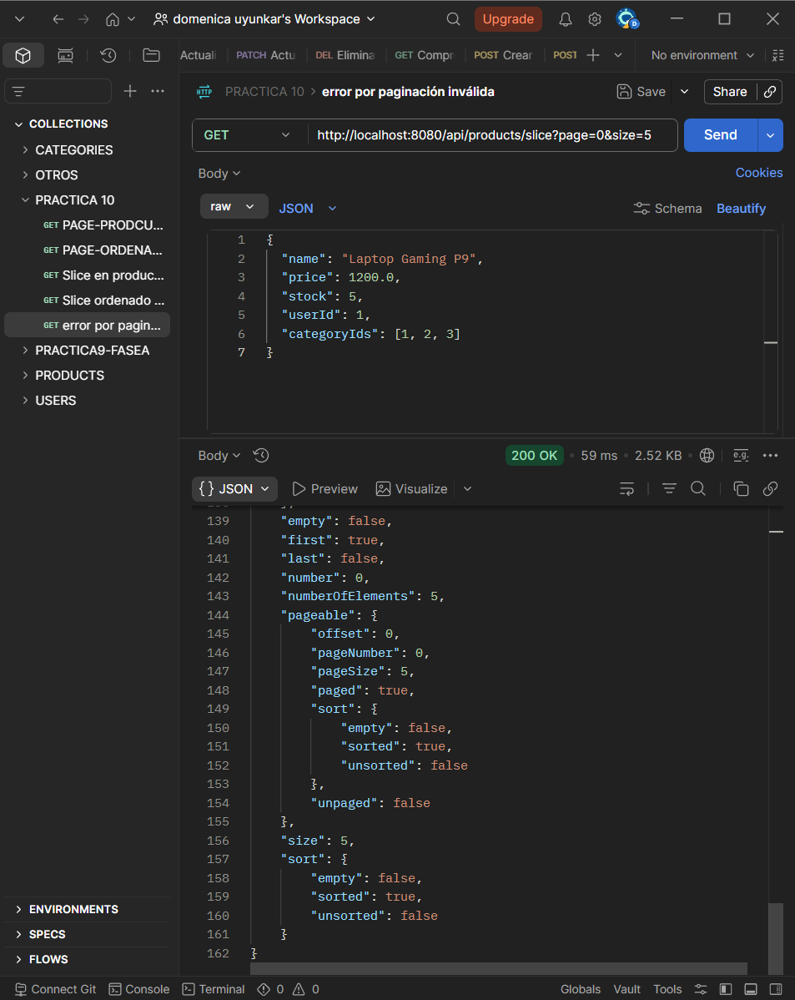

### Evidencia 3: Error por paginación inválida

Se realizó una petición con parámetros inválidos.

```http
GET /api/products/page?page=-1&size=0
```

La API respondió con `400 Bad Request` usando el formato estándar de `ErrorResponse`.

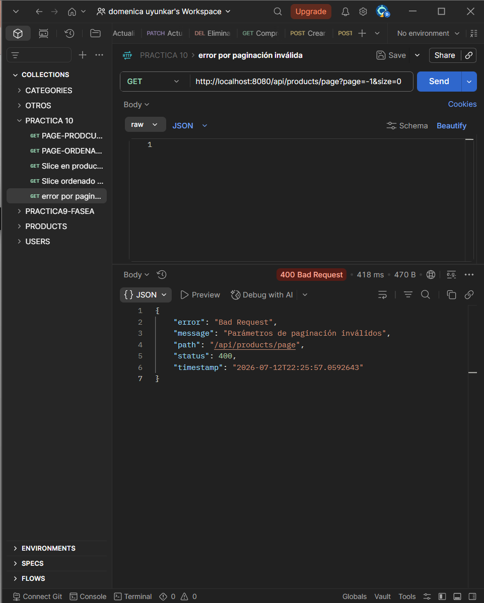

### Evidencia 4: Categoría paginada con Page

Se realizó una consulta de productos filtrados por categoría usando `Page`.

```http
GET /api/categories/2/products/page?page=110&size=5
```

La respuesta evidencia productos filtrados por categoría, paginación aplicada y metadatos de `Page`.

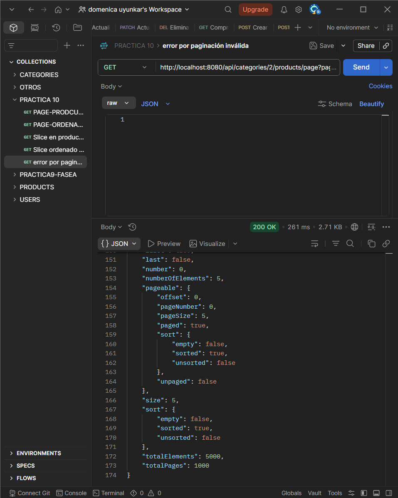

### Evidencia 5: Categoría paginada con Slice

Se realizó una consulta de productos filtrados por categoría usando `Slice`.

```http
GET /api/categories/2/products/slice?page=10&size=5
```

La respuesta evidencia productos filtrados por categoría, paginación aplicada y metadatos de `Slice`.

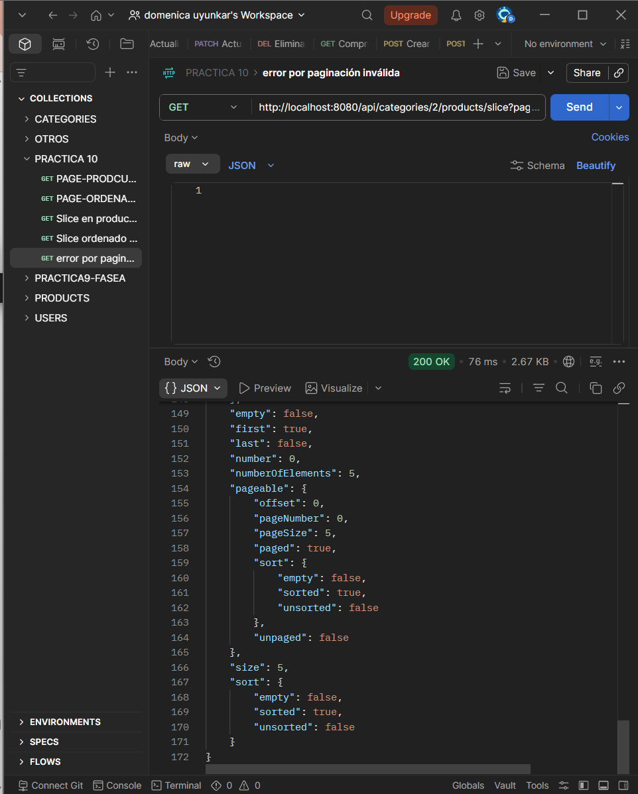

## Explicación

`Page` devuelve los datos de la página y también calcula información total, como `totalElements` y `totalPages`. Es útil cuando se necesita saber cuántas páginas existen.

`Slice` devuelve los datos de la página, pero no calcula el total general. Por eso es más eficiente cuando solo se necesita saber si existe una página siguiente.

La paginación debe aplicarse en el repositorio porque así la base de datos devuelve solo los registros necesarios. Si primero se traen todos los datos a memoria y luego se pagina, se consume más memoria y se reduce el rendimiento.

## Conclusión

La paginación permite manejar grandes cantidades de datos de forma eficiente. `Page` ofrece más metadatos, mientras que `Slice` es más ligero y útil para navegación simple.

---

# Práctica 11: Autenticación JWT

## Descripción

En esta práctica se implementó autenticación con JWT usando Spring Security.

Ahora los usuarios pueden registrarse, iniciar sesión y recibir un token. Ese token se usa para acceder a endpoints protegidos.

## Evidencias

### Evidencia 1: Registro exitoso

Se realizó el registro de un usuario.

```http
POST /api/auth/register
```

Debe evidenciar `201 Created`, token generado y rol `ROLE_USER`.

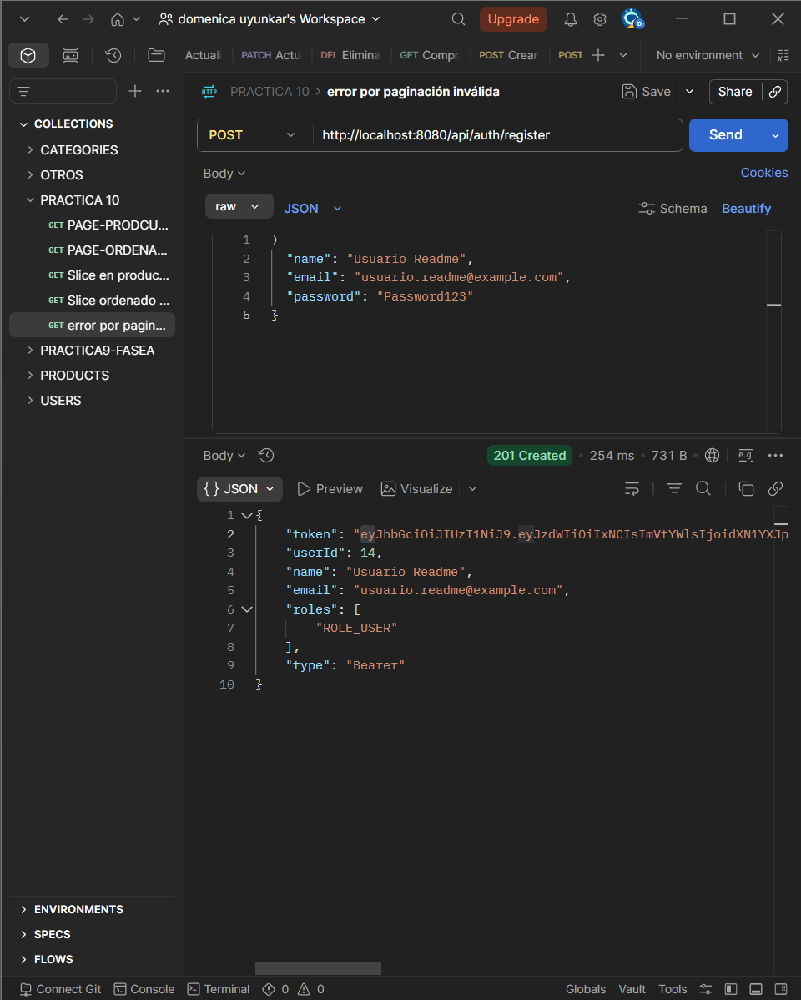

### Evidencia 2: Login exitoso

Se realizó el inicio de sesión.

```http
POST /api/auth/login
```

Debe evidenciar `200 OK`, token generado y roles devueltos.

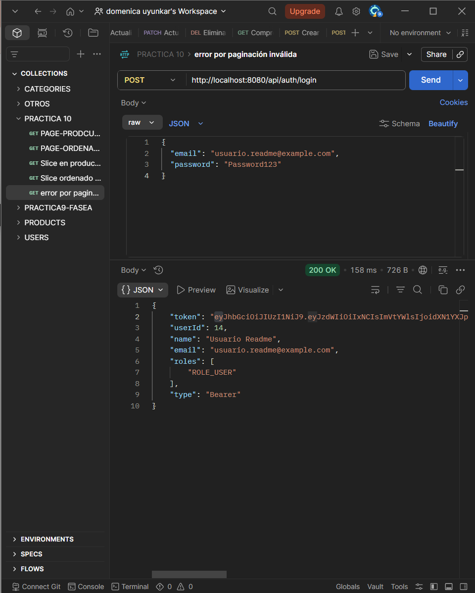

### Evidencia 3: Endpoint protegido sin token

Se intentó acceder a un endpoint protegido sin enviar token.

```http
GET /api/products/page?page=0&size=5
```

Debe evidenciar `401 Unauthorized`.

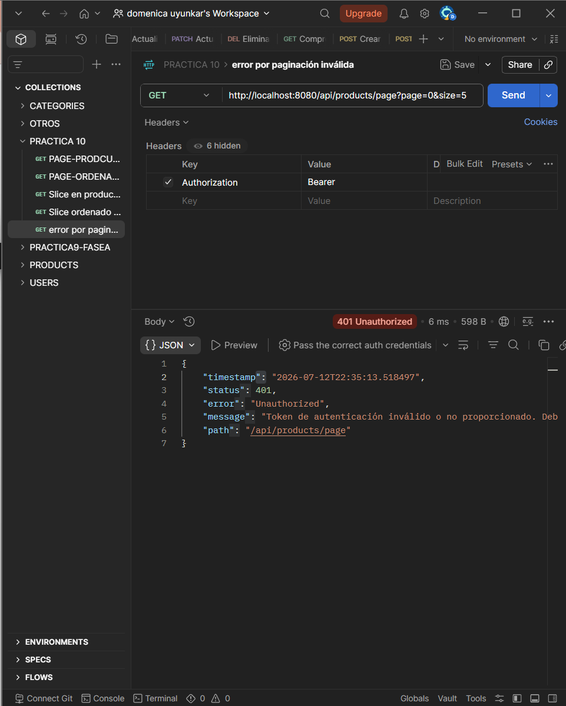

### Evidencia 4: Endpoint protegido con token

Se accedió al endpoint protegido enviando el token JWT.

```http
GET /api/products/page?page=0&size=5
Authorization: Bearer <token>
```

Debe evidenciar `200 OK`.

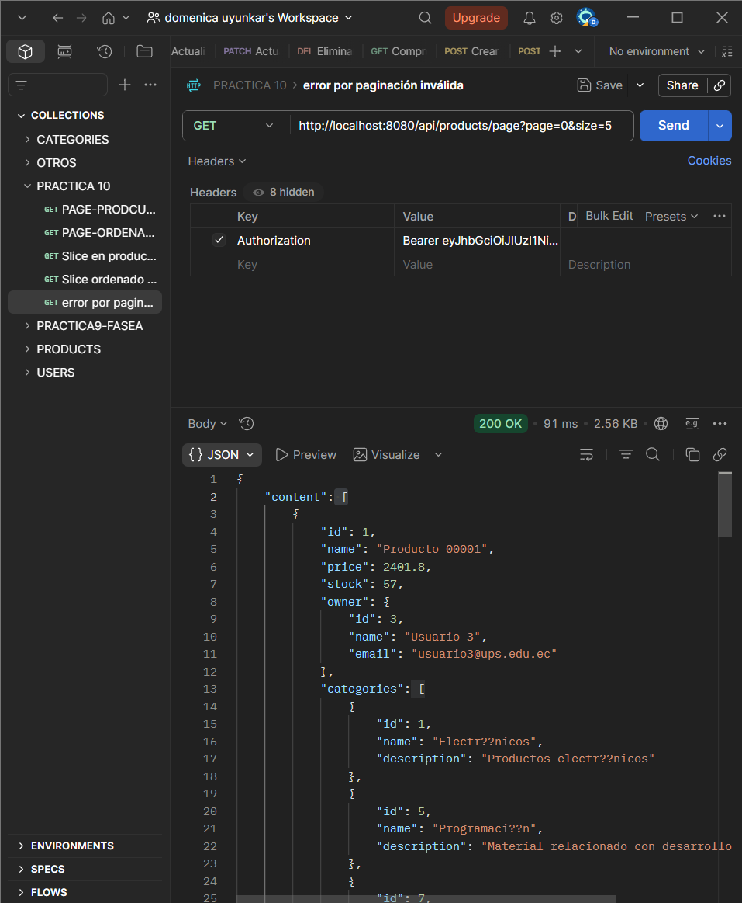

## Explicación

JWT permite autenticar al usuario sin mantener sesiones en el servidor. Cuando el usuario inicia sesión, recibe un token firmado. Luego, en cada petición protegida, debe enviar ese token en el header `Authorization`.

Si el token es válido, Spring Security permite el acceso. Si no existe o es inválido, la API responde con `401 Unauthorized`.

## Conclusión

La autenticación JWT protege los endpoints de la API y permite identificar al usuario autenticado en cada petición.

---

# Práctica 12: Roles y autorización con @PreAuthorize

## Descripción

En esta práctica se implementó autorización por roles usando `@PreAuthorize`.

La autenticación verifica quién es el usuario mediante JWT, mientras que la autorización verifica qué puede hacer ese usuario según sus roles.

## Evidencias

### Evidencia 1: Usuario autenticado

Se consultó la información del usuario autenticado.

```http
GET /api/users/me
Authorization: Bearer <token>
```

Debe evidenciar `id`, `name`, `email` y `roles`.

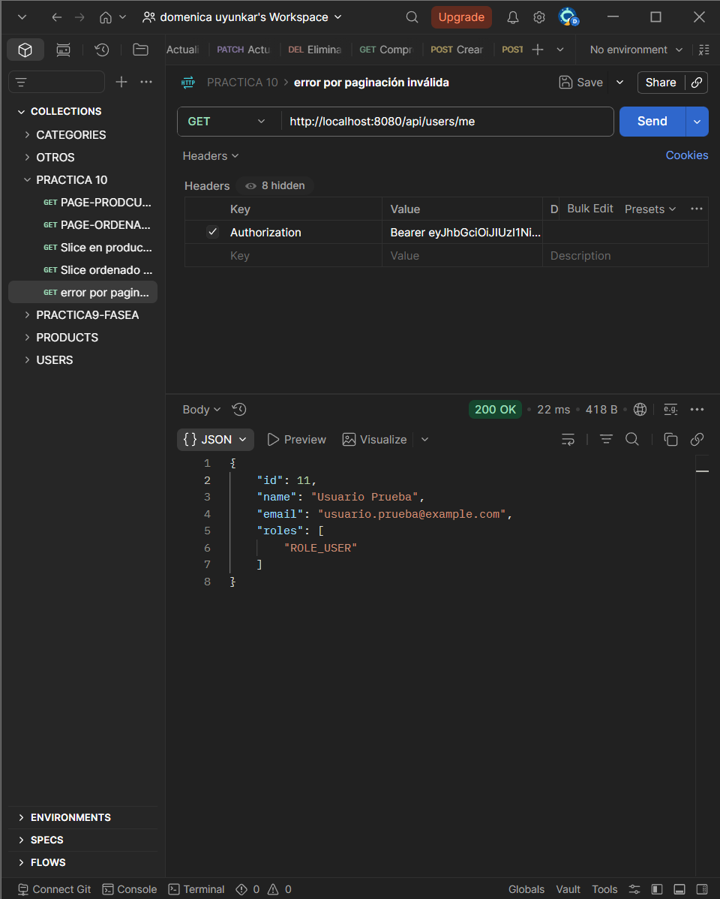

### Evidencia 2: Acceso denegado por rol

Se intentó acceder al listado completo de productos con un usuario que solo tiene `ROLE_USER`.

```http
GET /api/products
Authorization: Bearer <token-role-user>
```

Debe evidenciar `403 Forbidden`.

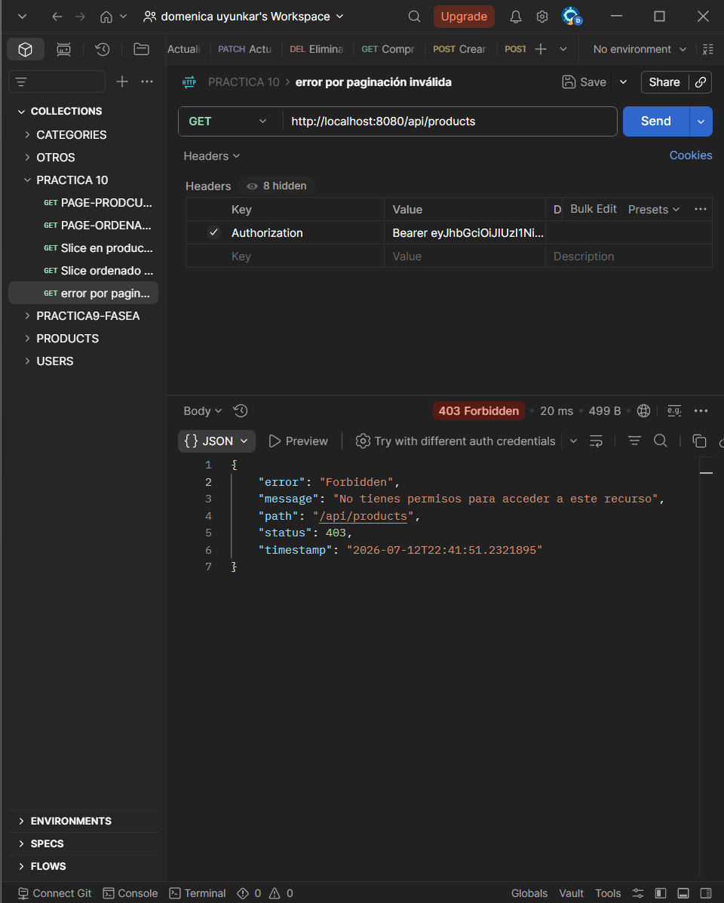

### Evidencia 3: Acceso permitido por rol ADMIN

Se accedió al listado completo de productos con un usuario que tiene `ROLE_ADMIN`.

```http
GET /api/products
Authorization: Bearer <token-role-admin>
```

Debe evidenciar `200 OK`.

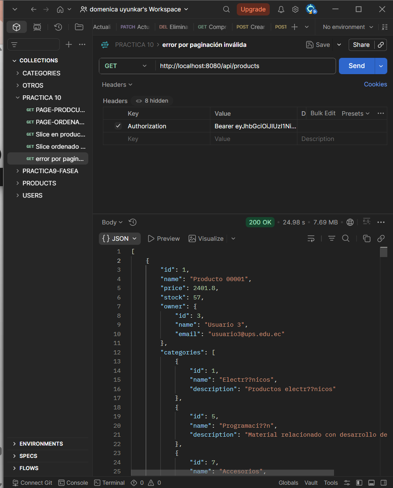

## Explicación

La autenticación responde a la pregunta: ¿quién eres? En este proyecto se realiza mediante un token JWT válido.

La autorización responde a la pregunta: ¿qué puedes hacer? En esta práctica se realiza mediante roles, por ejemplo `ROLE_USER` y `ROLE_ADMIN`.

`GET /api/products` debe ser solo para ADMIN porque devuelve todos los productos sin paginación. Esto puede exponer demasiada información y afectar el rendimiento.

En cambio, `GET /api/products/page` puede ser consumido por cualquier usuario autenticado porque devuelve los datos paginados y limita la cantidad de registros por respuesta.

## Conclusión

La autorización por roles permite restringir acciones según el tipo de usuario. Con `@PreAuthorize("hasRole('ADMIN')")`, solo los administradores pueden consultar el listado completo de productos.   

# Práctica 13: Validación de Ownership

## Objetivo

En esta práctica se implementó la validación de ownership o propiedad de recursos en productos.

El objetivo fue asegurar que un usuario autenticado con `ROLE_USER` solo pueda modificar o eliminar productos que le pertenecen, mientras que un usuario con `ROLE_ADMIN` pueda modificar o eliminar cualquier producto.

También se ajustó la creación de productos para que el propietario ya no se reciba desde el body mediante `userId`, sino que se obtenga automáticamente desde el token JWT del usuario autenticado.

---

## Cambios realizados

- Se eliminó el campo `userId` de `CreateProductDto`.
- Se actualizó `ProductService` para recibir el usuario autenticado.
- Se actualizó `ProductsController` usando `@AuthenticationPrincipal`.
- Se agregó validación de ownership en `ProductServiceImpl`.
- Se permitió que `ROLE_ADMIN` pueda modificar productos ajenos.
- Se actualizó `GlobalExceptionHandler` para mostrar el mensaje real del acceso denegado.

---

## Evidencias

### Evidencia 1: Creación de producto con usuario autenticado

Punto final utilizado:

```http
POST /api/products
```

En esta prueba se creó un producto usando el token de `Usuario A`.

El producto fue creado correctamente con estado `201 Created` y el campo `owner` corresponde al usuario autenticado.

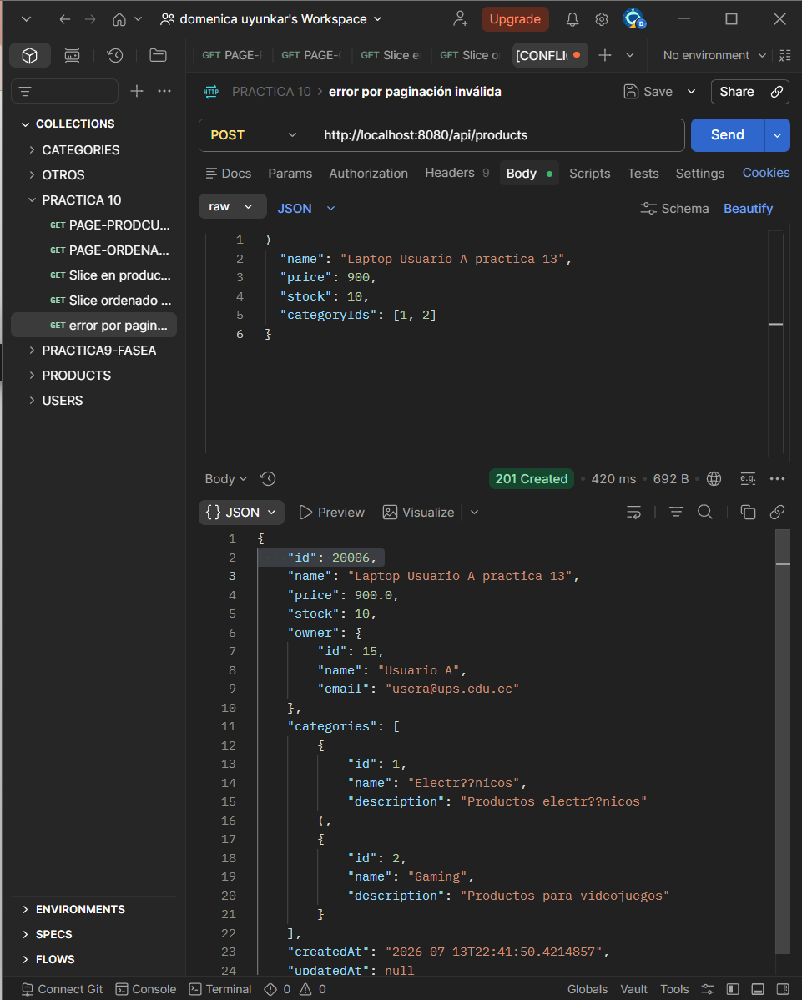

---

### Evidencia 2: Bloqueo por producto ajeno

Punto final utilizado:

```http
PUT /api/products/{id}
```

En esta prueba, `Usuario B` intentó modificar un producto que pertenece a `Usuario A`.

El sistema bloqueó correctamente la operación con estado `403 Forbidden`.

Mensaje obtenido:

```txt
No puedes modificar productos ajenos
```

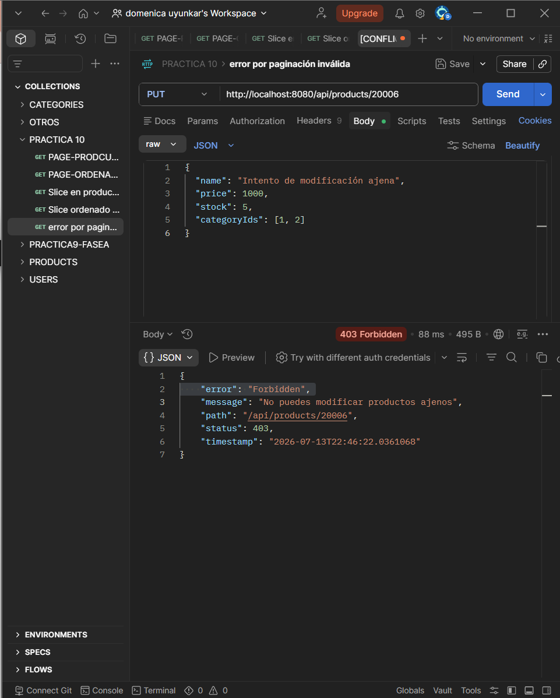

---

### Evidencia 3: Eliminación de producto ajeno bloqueada

Punto final utilizado:

```http
DELETE /api/products/{id}
```

En esta prueba, `Usuario B` intentó eliminar un producto que pertenece a `Usuario A`.

El sistema rechazó la eliminación porque el producto no pertenece al usuario autenticado.

Resultado obtenido:

```txt
403 Forbidden
```

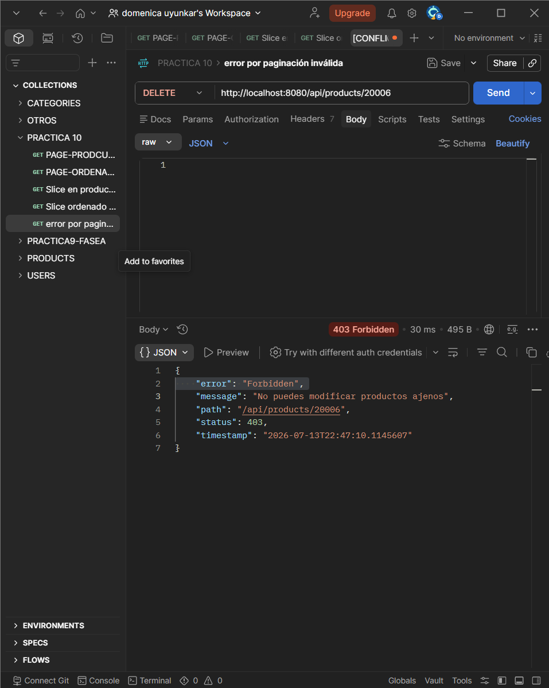

---

### Evidencia 4: ADMIN modificando producto ajeno

Punto final utilizado:

```http
PUT /api/products/{id}
```

En esta prueba se utilizó un token con `ROLE_ADMIN`.

El usuario administrador pudo modificar correctamente un producto perteneciente a otro usuario.

Resultado obtenido:

```txt
200 OK
```

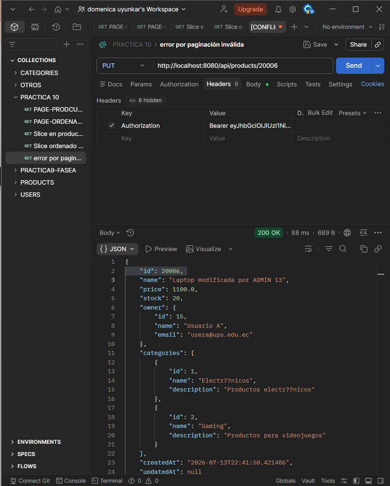

---

## ¿Qué es ownership?

Ownership significa propiedad de un recurso.

En este proyecto, un producto pertenece a un usuario mediante el campo `owner`. Por eso, antes de modificar o eliminar un producto, el sistema valida si el usuario autenticado es el dueño del producto.

Si el usuario autenticado es dueño del producto, la operación se permite. Si no es dueño, la operación se rechaza con `403 Forbidden`.

---

## ¿Por qué no es seguro recibir userId en CreateProductDto?

No es seguro recibir `userId` en `CreateProductDto` porque el cliente podría enviar el ID de otro usuario y crear productos a nombre de una persona diferente.

Por ejemplo, un usuario autenticado podría enviar en el body el ID de otro usuario:

```json
{
  "name": "Laptop",
  "price": 900,
  "stock": 10,
  "userId": 5,
  "categoryIds": [1, 2]
}
```

Esto permitiría crear productos para un usuario diferente al autenticado.

Por seguridad, el owner debe obtenerse desde el token JWT, ya que el token representa al usuario que inició sesión.

---

## Diferencia entre autorización por rol y autorización por ownership

La autorización por rol valida qué tipo de usuario realiza la acción.

Por ejemplo:

```txt
ROLE_ADMIN puede acceder a funcionalidades administrativas.
ROLE_USER tiene permisos limitados.
```

La autorización por ownership valida si el recurso pertenece al usuario autenticado.

Por ejemplo:

```txt
Usuario A puede modificar sus propios productos.
Usuario B no puede modificar productos de Usuario A.
ROLE_ADMIN sí puede modificar productos de cualquier usuario.
```

En resumen:

```txt
Autorización por rol: ¿Qué rol tiene este usuario?
Autorización por ownership: ¿Este recurso le pertenece a este usuario?
```

---

## Conclusión

Con esta práctica se reforzó la seguridad de la API aplicando autorización contextual.

Ahora, un usuario autenticado no solo necesita tener un token válido, sino que también debe ser propietario del producto para poder modificarlo o eliminarlo.

Esto evita que usuarios normales puedan modificar o eliminar productos ajenos, mientras que los administradores mantienen permisos especiales sobre todos los productos.

---

# Práctica 14: Refresh Token con JWT

## Descripción

En esta práctica se implementó el uso de `refreshToken` para renovar el `access token` sin necesidad de iniciar sesión nuevamente.

El sistema permite:

- Iniciar sesión y recibir un `token` y un `refreshToken`.
- Renovar los tokens usando `/api/auth/refresh`.
- Cerrar sesión usando `/api/auth/logout`.
- Revocar refresh tokens para evitar que sean reutilizados.

---

## Evidencias

### Evidencia 1: Login con refresh token

Endpoint probado:

```http
POST /api/auth/login
```

En esta prueba se realizó el inicio de sesión correctamente.

La respuesta devuelve:

- `token`
- `refreshToken`
- `type`
- `userId`
- `name`
- `email`
- `roles`

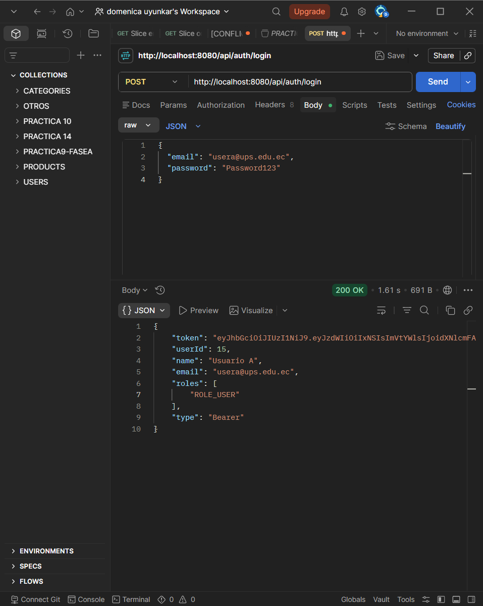

---

### Evidencia 2: Refresh exitoso

Endpoint probado:

```http
POST /api/auth/refresh
```

Se envió el `refreshToken` en el body de la petición.

La API respondió con `200 OK` y generó un nuevo `token` y un nuevo `refreshToken`.

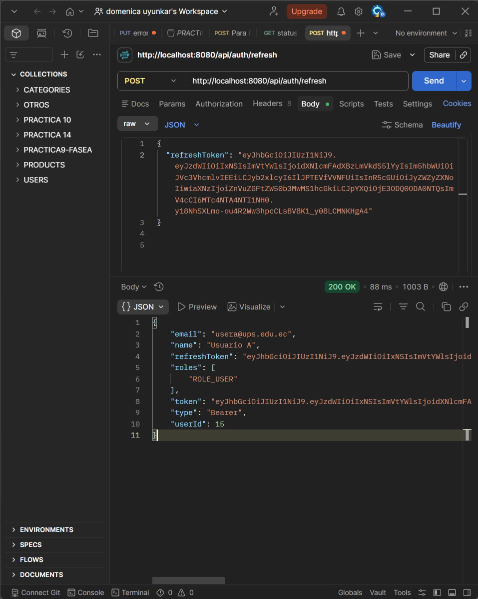

---

### Evidencia 3: Logout

Endpoint probado:

```http
POST /api/auth/logout
```

Se envió el `refreshToken` actual para cerrar sesión.

La API respondió con `204 No Content`, indicando que el refresh token fue revocado correctamente.

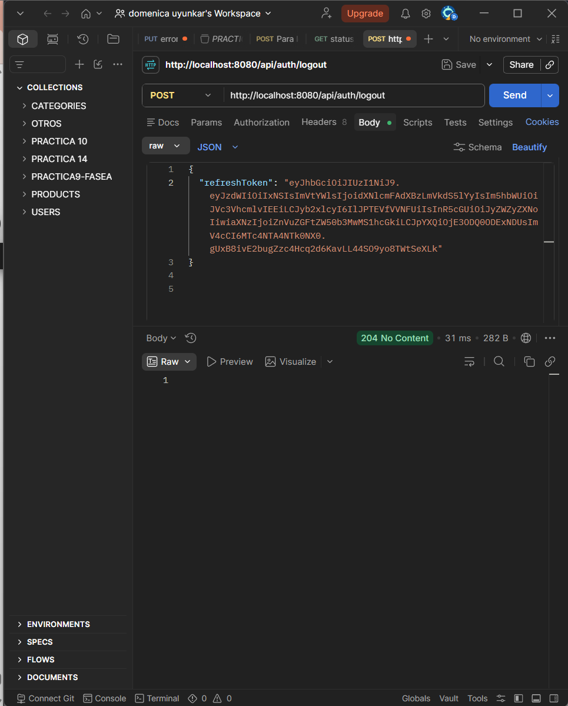

---

### Evidencia 4: Refresh después de logout

Endpoint probado:

```http
POST /api/auth/refresh
```

Después de cerrar sesión, se intentó usar nuevamente el mismo `refreshToken`.

La API respondió con `400 Bad Request`, indicando que el refresh token ya no es válido porque fue revocado.

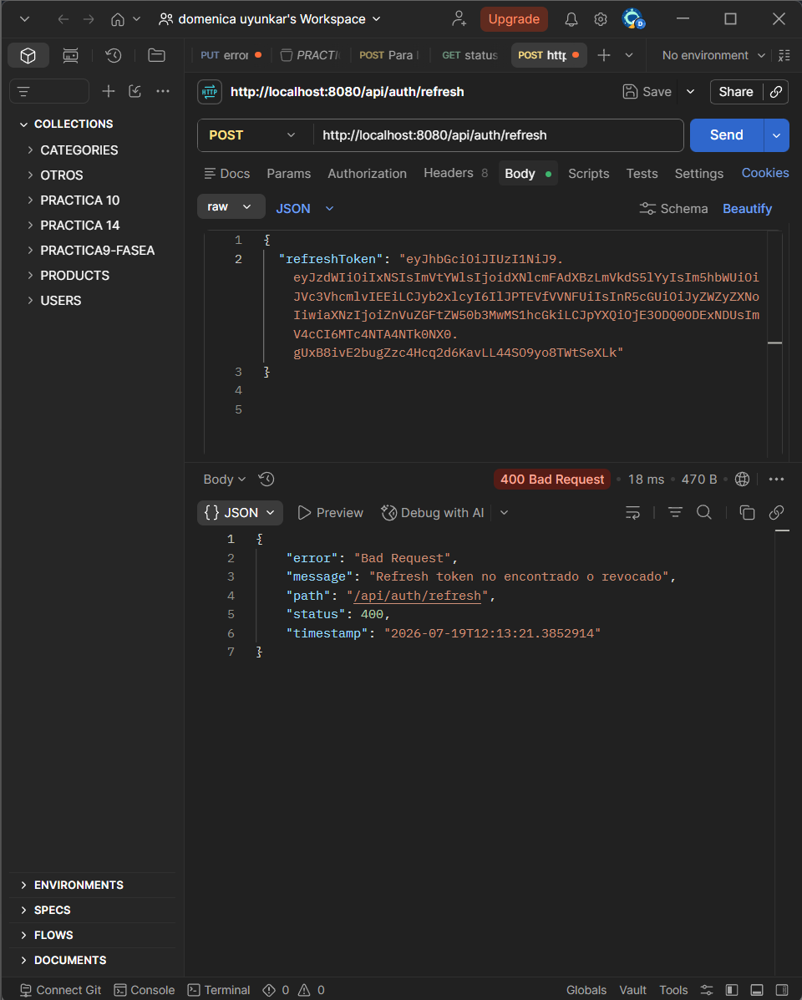

---

## Explicación breve

### ¿Cuál es la diferencia entre access token y refresh token?

El `access token` es el token que se usa para consumir endpoints protegidos de la API.

Se envía en el header `Authorization` con el formato:

```http
Authorization: Bearer <token>
```

Este token tiene una duración corta, por ejemplo 30 minutos.

El `refresh token` se usa únicamente para renovar la sesión cuando el access token expira. Tiene una duración más larga y se envía en el body del endpoint `/api/auth/refresh`.

---

### ¿Por qué el refresh token no debe usarse en Authorization: Bearer?

El `refreshToken` no debe usarse en `Authorization: Bearer` porque no está diseñado para consumir endpoints protegidos.

Su único propósito es renovar tokens mediante el endpoint:

```http
POST /api/auth/refresh
```

Si un refresh token se pudiera usar como Bearer token, sería un problema de seguridad, porque un token de larga duración podría acceder directamente a recursos protegidos.

Por eso, el backend valida que el token enviado en el header sea de tipo `access` y no de tipo `refresh`.

---

### ¿Qué significa rotar un refresh token?

Rotar un refresh token significa que cada vez que se usa un refresh token para renovar la sesión, ese refresh token anterior se revoca y se genera uno nuevo.

---

## Conclusión

Se implementó correctamente el flujo de refresh token con JWT.

La API ahora puede generar access tokens y refresh tokens, renovar sesión, revocar refresh tokens durante el logout y rechazar refresh tokens revocados. Esto mejora la seguridad del sistema de autenticación.

# Práctica 15: Documentación con Swagger, OpenAPI y Seguridad JWT

## Descripción

En esta práctica se implementó la documentación interactiva de la API usando Swagger UI y OpenAPI.

Swagger permitió visualizar los controladores, probar endpoints desde el navegador y enviar JWT mediante el botón `Authorize`.

## Rutas principales

| Ruta | Descripción |
| ---- | ----------- |
| `/api/swagger-ui/index.html` | Interfaz visual de Swagger UI |
| `/api/v3/api-docs` | Documento OpenAPI en formato JSON |

---

## Evidencias

### Evidencia 1: Swagger UI cargado

Ruta utilizada:

```http
GET /api/swagger-ui/index.html
```

Se evidencia la lista de controladores y los endpoints agrupados por tags.

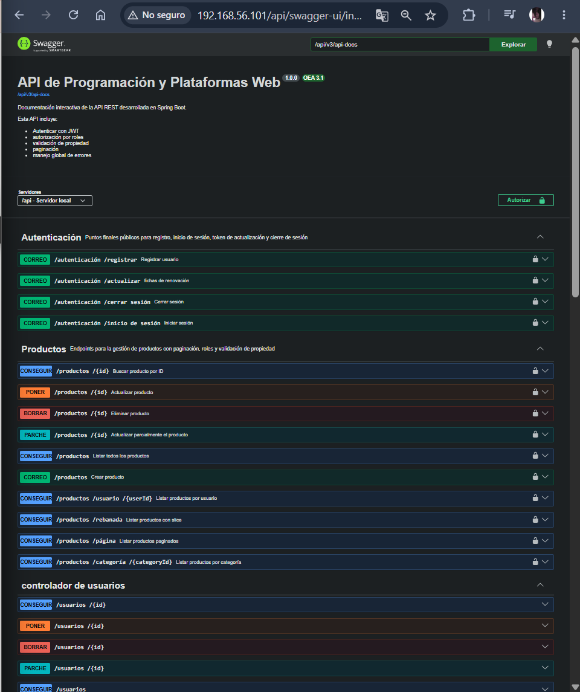

---

### Evidencia 2: JSON OpenAPI

Ruta utilizada:

```http
GET /api/v3/api-docs
```

Se evidencia el documento JSON generado por OpenAPI, incluyendo `openapi`, `paths` y `components`.

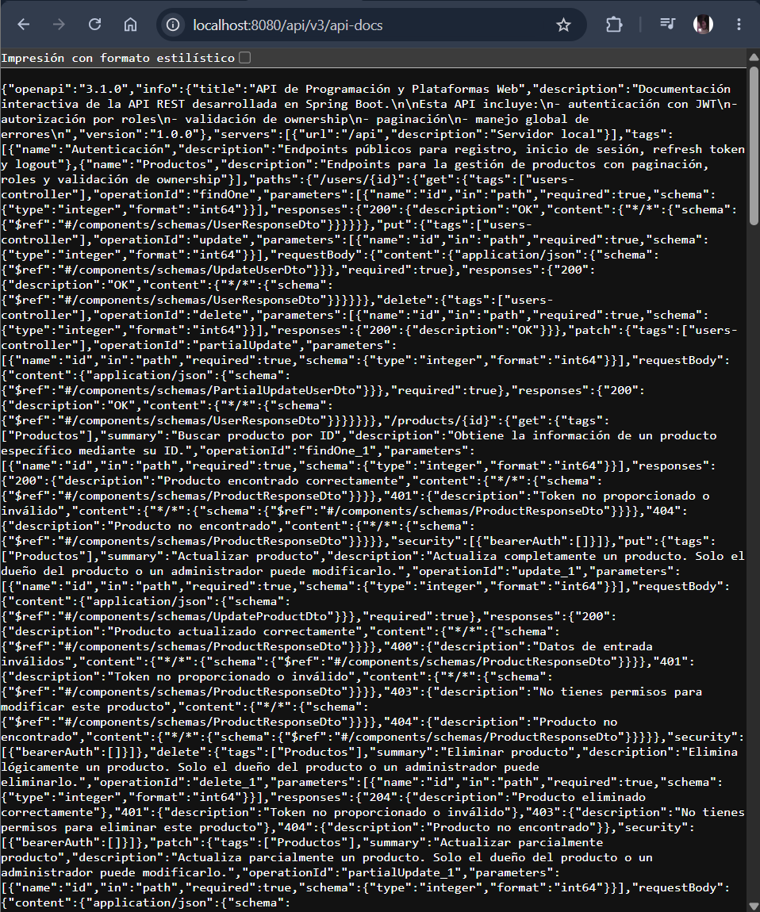

---

### Evidencia 3: Botón Authorize con JWT

Se configuró Swagger para permitir autenticación con JWT mediante el esquema `bearerAuth`.

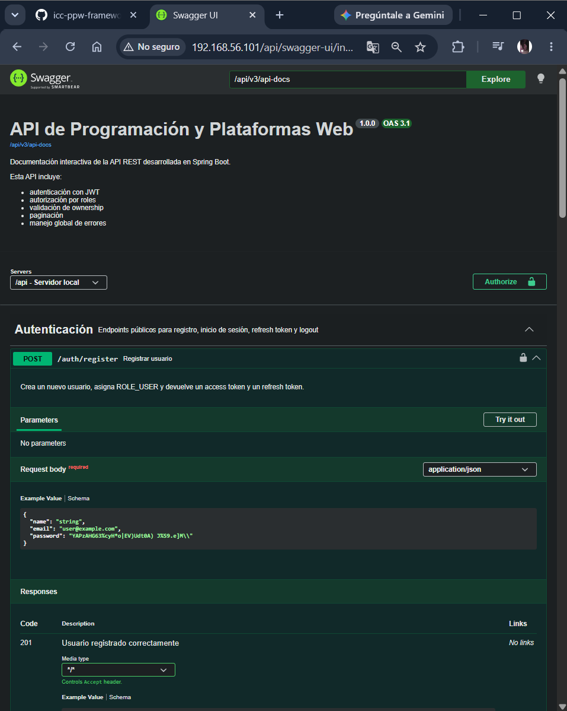

---

### Evidencia 4: Endpoint protegido sin token

Endpoint probado:

```http
GET /api/products/page?page=0&size=5
```

Al ejecutar el endpoint sin token, la API respondió:

```txt
401 Unauthorized
```

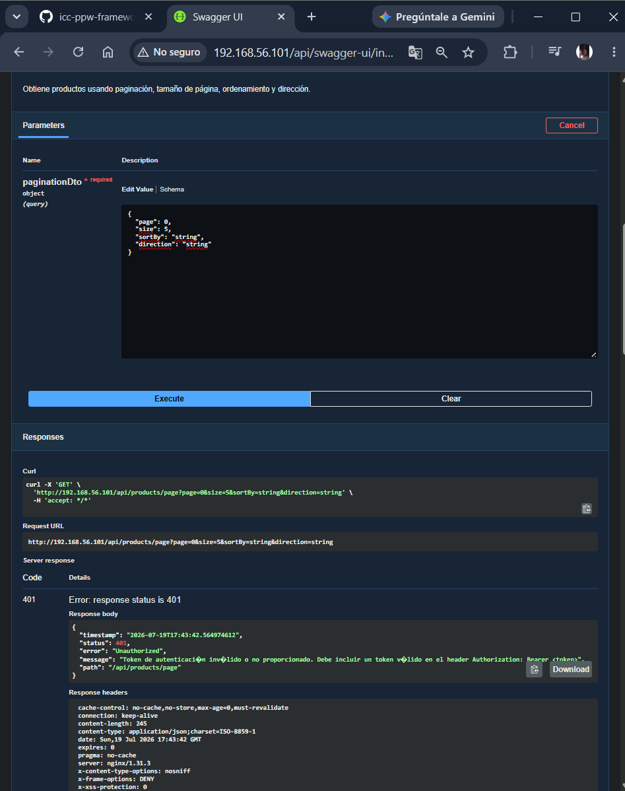

---

### Evidencia 5: Endpoint protegido con token desde Swagger

Endpoint probado:

```http
GET /api/products/page?page=0&size=5
```

Después de iniciar sesión, copiar el token y autorizarlo en Swagger, el endpoint respondió:

```txt
200 OK
```

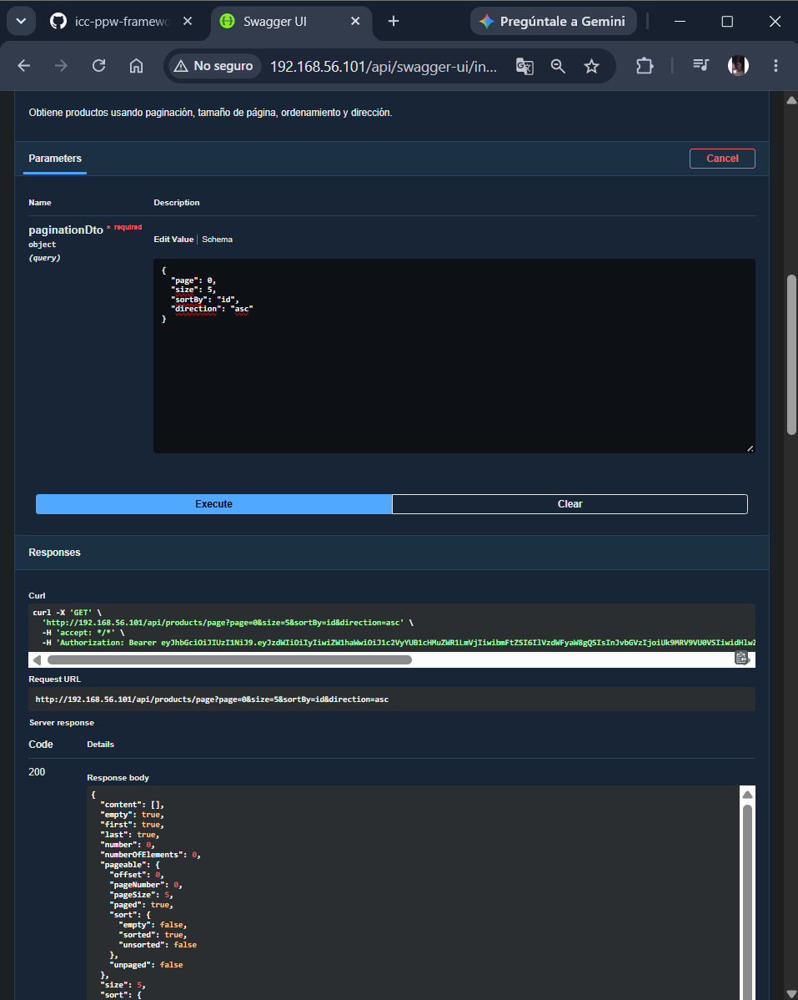

---

### Evidencia 6: Endpoint ADMIN con usuario normal

Endpoint probado:

```http
GET /api/products
```

Se utilizó un token con rol:

```txt
ROLE_USER
```

Como el endpoint requiere permisos de administrador, la API respondió:

```txt
403 Forbidden
```

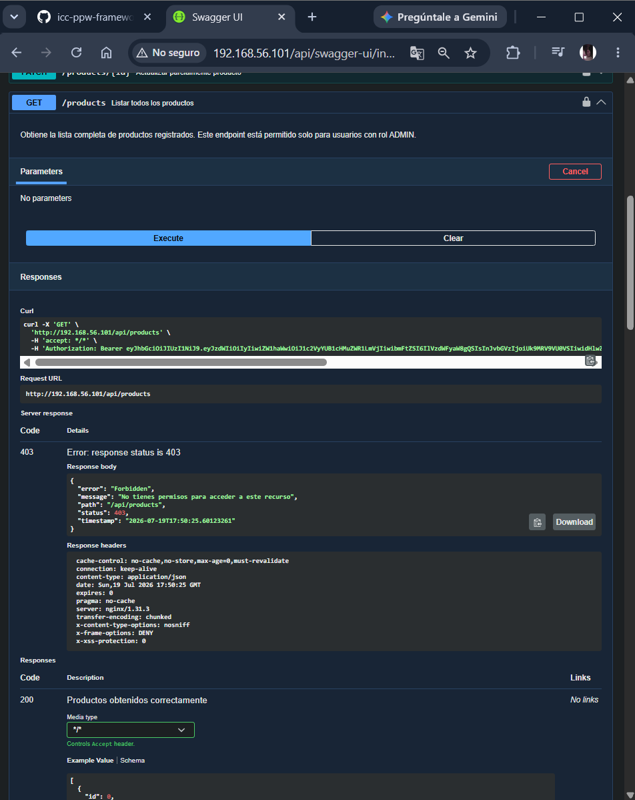

---

### Evidencia 7: Endpoint ADMIN con usuario administrador

Endpoint probado:

```http
GET /api/products
```

Se utilizó un token con rol:

```txt
ROLE_ADMIN
```

La API permitió el acceso y respondió:

```txt
200 OK
```

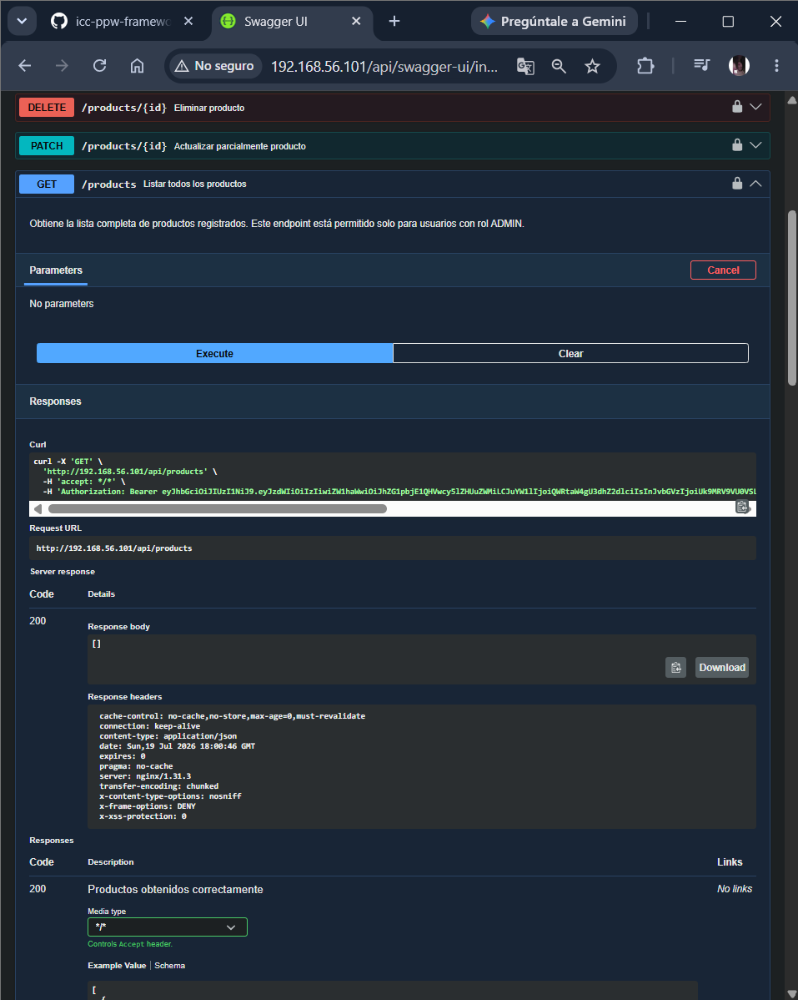

---

## Explicación breve

### ¿Cuál es la diferencia entre Swagger UI y OpenAPI?

OpenAPI es la especificación que describe la API en formato JSON o YAML.  
Incluye información sobre rutas, métodos HTTP, parámetros, cuerpos de petición, respuestas, schemas y seguridad.

Swagger UI es la interfaz visual que lee esa documentación OpenAPI y permite verla de forma interactiva desde el navegador.

En resumen:

```txt
OpenAPI = descripción técnica de la API
Swagger UI = interfaz visual para leer y probar la API
```

---

### ¿Por qué Swagger puede ser público pero los endpoints seguir protegidos?

Swagger UI puede ser público porque solo muestra la documentación de la API.

Sin embargo, los endpoints protegidos siguen requiriendo JWT porque Spring Security mantiene la regla de autenticación para las rutas privadas.

Por eso una persona puede ver la documentación, pero si intenta consumir un endpoint protegido sin token, la API responde `401 Unauthorized`.

---

### ¿Cómo se configura Swagger para enviar un JWT en Authorization: Bearer?

Se configura un esquema de seguridad tipo HTTP Bearer en `OpenApiConfig`.

Ese esquema se llama:

```txt
bearerAuth
```

Luego se usa `@SecurityRequirement(name = "bearerAuth")` en los controladores protegidos.

Con esta configuración, Swagger muestra el botón `Authorize`. Al pegar el token JWT, Swagger envía automáticamente el header:

```http
Authorization: Bearer <token>
```

---

## Conclusión

Se documentó correctamente la API con Swagger y OpenAPI.

Además, se integró la seguridad JWT en Swagger, permitiendo probar endpoints públicos y protegidos desde la interfaz web.

---

# Práctica 16: Despliegue en Ubuntu Server con Docker y Nginx

## Descripción

En esta práctica se desplegó la API Spring Boot dentro de una máquina virtual con Ubuntu Server.

Se utilizaron contenedores Docker para ejecutar PostgreSQL, la API Spring Boot y Nginx.  
Nginx quedó expuesto por el puerto `80`, mientras que Spring Boot y PostgreSQL quedaron privados dentro de la red Docker.

---

## Evidencias

### Evidencia 1: Contenedores ejecutándose en Ubuntu Server

Se verificó con `docker ps` que los contenedores `nginx`, `fundamentos-api` y `postgres` se encuentran en ejecución.

También se evidencia que únicamente Nginx está publicado al exterior por el puerto `80`.

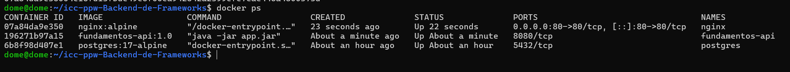

---

### Evidencia 2: Validación de configuración de Nginx

Se validó la configuración de Nginx con el comando:

```bash
docker exec nginx nginx -t
```

La respuesta confirmó que la configuración es correcta.

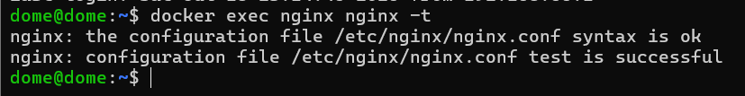

---

### Evidencia 3: Nginx activo desde Ubuntu Server

Se probó Nginx desde Ubuntu usando:

```bash
curl http://localhost
```

La respuesta confirmó que Nginx está activo.

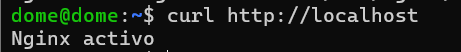

---

### Evidencia 4: Health check desde Ubuntu Server

Se probó el endpoint de Actuator desde Ubuntu:

```bash
curl http://localhost/api/actuator/health
```

La API respondió con estado `UP`.

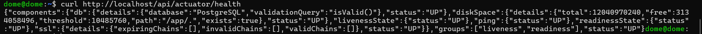

---

### Evidencia 5: Health check desde la máquina anfitriona

Desde Windows se accedió al endpoint:

```http
GET http://192.168.56.101/api/actuator/health
```

La respuesta mostró el estado `UP`, demostrando que la máquina anfitriona puede consumir la API mediante Nginx.

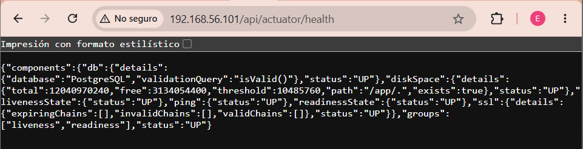

---

### Evidencia 6: Consumo de login desde la máquina anfitriona

Desde Bruno/Postman en Windows se probó el endpoint:

```http
POST http://192.168.56.101/api/auth/login
```

La API respondió correctamente, demostrando que el tráfico llega desde Windows hacia Nginx y luego hacia Spring Boot.

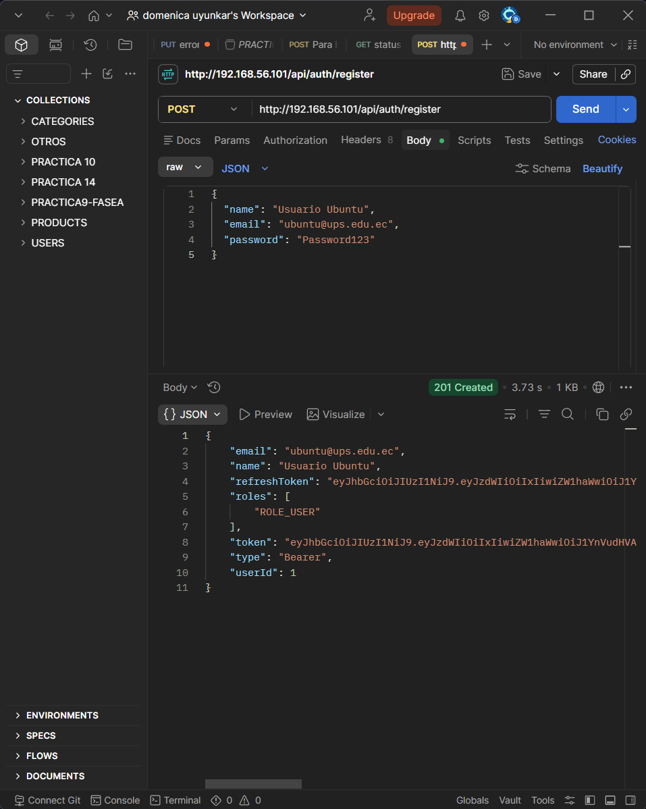

---

### Evidencia 7: Swagger publicado mediante Nginx

Se verificó que Swagger UI también está disponible desde la máquina anfitriona mediante Nginx.

Ruta utilizada:

```http
GET http://192.168.56.101/api/swagger-ui/index.html
```

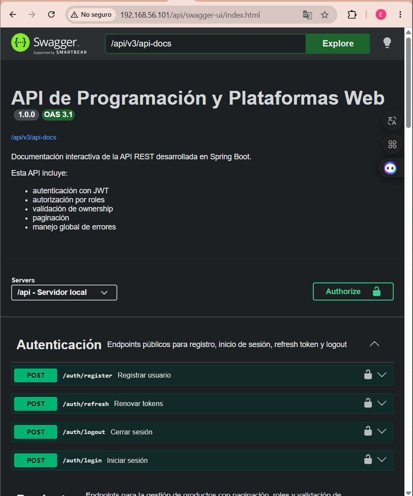

---

## Configuración de PostgreSQL

En esta práctica se utilizó PostgreSQL como contenedor dentro de Ubuntu Server, conectado a la misma red Docker que la API.

La API no tiene las credenciales dentro de la imagen.  
La conexión a base de datos se entregó mediante variables de entorno usando el archivo `.env.ubuntu`.

Ejemplo de conexión utilizada:

```txt
SPRING_DATASOURCE_URL=jdbc:postgresql://postgres:5432/devdb
SPRING_DATASOURCE_USERNAME=ups
SPRING_DATASOURCE_PASSWORD=ups123
```

Esto permite que la imagen de Spring Boot sea reutilizable, porque la configuración cambia según el entorno y no queda fija dentro del código.

---

## Explicación breve

Nginx funciona como proxy inverso. Recibe las peticiones desde la máquina anfitriona por el puerto `80` y las redirige al contenedor de Spring Boot dentro de la red Docker.

Spring Boot no se publica directamente al exterior, porque no tiene `-p 8080:8080`. Solo Nginx puede comunicarse con la API dentro de `app-network`.

PostgreSQL también queda privado dentro de la red Docker y la API se conecta usando el nombre del contenedor `postgres`.

---

## Conclusión

Se desplegó correctamente la API Spring Boot en Ubuntu Server usando Docker y Nginx.

El resultado final permite consumir la API desde la máquina anfitriona a través de Nginx, manteniendo Spring Boot y PostgreSQL privados dentro de la red Docker.