# Fundamentos Spring Boot

## Autor

Domenica Uyunkar

## Descripción

Proyecto básico desarrollado con Spring Boot para verificar la instalación, configuración y funcionamiento del framework. La aplicación expone endpoints REST que permiten comprobar el estado del servicio y consultar una lista de estudiantes de prueba.

## Requisitos

* Java 21
* Gradle
* Spring Boot

## Ejecución

```bash
.\gradlew.bat bootRun
```

Una vez iniciado el proyecto, el servidor se ejecutará en el puerto 8080.

## Endpoints disponibles

### 1. Estado del servicio

```http
GET /api/status
```

Ejemplo de respuesta:

```json
{
    "status":"running",
    "service":"Spring Boot API",
    "timestamp":"2026-06-12T10:51:45.882028"
}
```

URL de prueba:

```text
http://localhost:8080/api/status
```

---

### 2. Listado de estudiantes

```http
GET /v1/students
```

Ejemplo de respuesta:

```json
[
    {
        "id": 1,
        "name": "JUAN",
        "age": 20
    },
    {
        "id": 2,
        "name": "MARIA",
        "age": 22
    }
]
```

URL de prueba:

```text
http://localhost:8080/v1/students
```

## Herramientas utilizadas

* Java 21
* Spring Boot
* Gradle
* Visual Studio Code
* Postman

## Evidencias

### Evidencia 1: Versión de Java

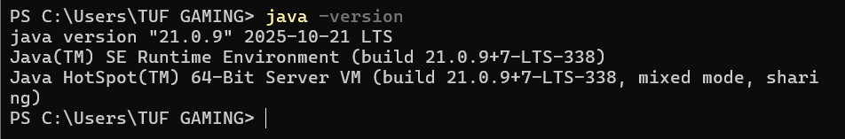

### Evidencia 2: Inicio de Tomcat

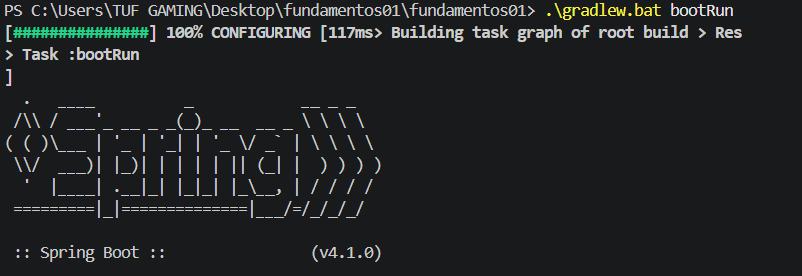

### Evidencia 3: Endpoint de estado funcionando

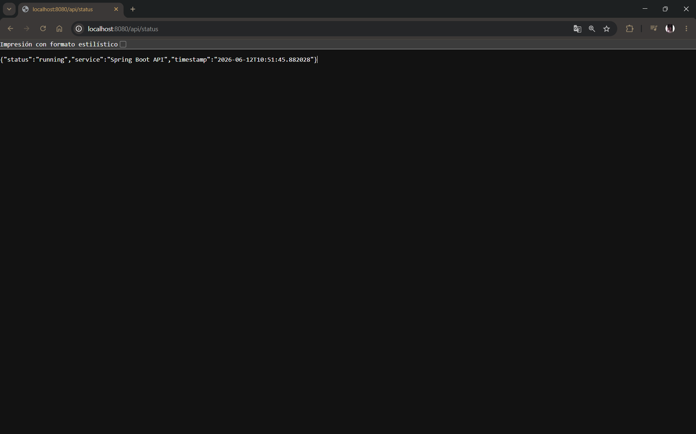

### Evidencia 4: Controlador de estado creado

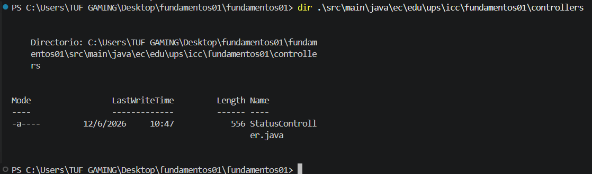

### Evidencia 5: Endpoint de estudiantes funcionando

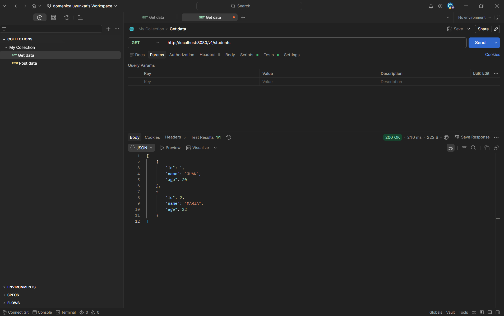
http://localhost:8080/v1/students

### Evidencia 6: Controlador de estudiantes creado

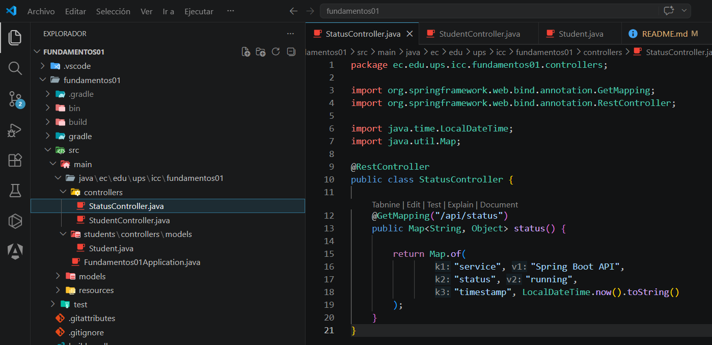

### Evidencia 7: Modelo Student creado

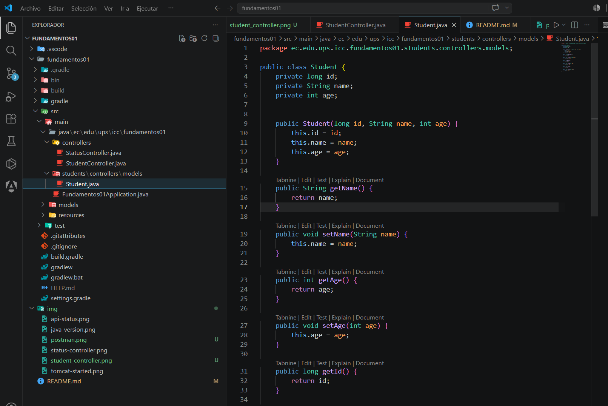


---

# Práctica 3: API REST CRUD de productos

## Descripción

En esta práctica se implementó un CRUD REST completo para el recurso de productos utilizando controladores, DTOs, modelos y mappers.

Los productos se almacenan temporalmente en una lista en memoria, sin utilizar una base de datos.

Cada producto contiene los siguientes atributos:

```java
private Long id;
private String name;
private Double price;
private Integer stock;
private LocalDateTime createdAt;
```

El identificador se genera automáticamente desde el backend y no debe ser enviado por el cliente.

## Endpoints de productos

| Método | Endpoint             | Descripción                          |
| ------ | -------------------- | ------------------------------------ |
| GET    | `/api/products`      | Obtener todos los productos          |
| GET    | `/api/products/{id}` | Obtener un producto por ID           |
| POST   | `/api/products`      | Crear un producto                    |
| PUT    | `/api/products/{id}` | Actualizar completamente un producto |
| PATCH  | `/api/products/{id}` | Actualizar parcialmente un producto  |
| DELETE | `/api/products/{id}` | Eliminar un producto                 |

## Evidencias del CRUD de productos

### Evidencia 8: Listado de tres productos creados

Se realizó la petición:

```http
GET /api/products
```

URL utilizada:

```text
http://localhost:8080/api/products
```

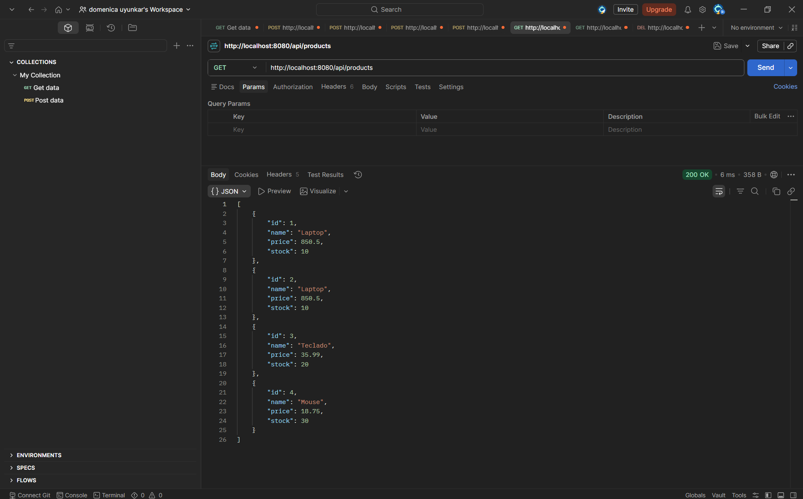

### Evidencia 9: Consulta de un producto existente

Se realizó una consulta utilizando el identificador de un producto registrado:

```http
GET /api/products/1
```

URL utilizada:

```text
http://localhost:8080/api/products/1
```

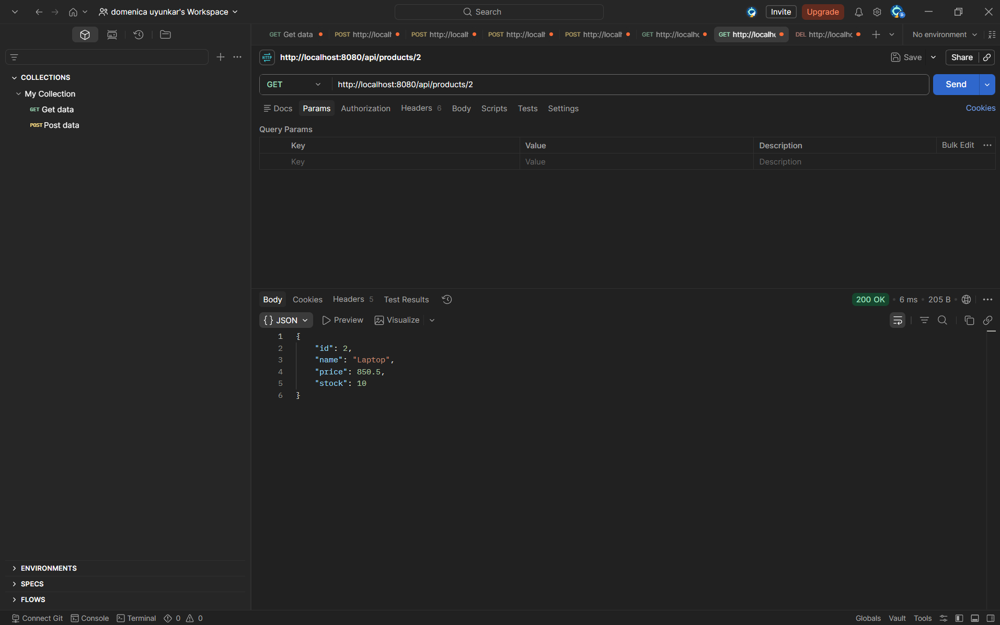

### Evidencia 10: Eliminación de un producto existente

Se realizó la eliminación de un producto registrado mediante su identificador:

```http
DELETE /api/products/1
```

URL utilizada:

```text
http://localhost:8080/api/products/1
```

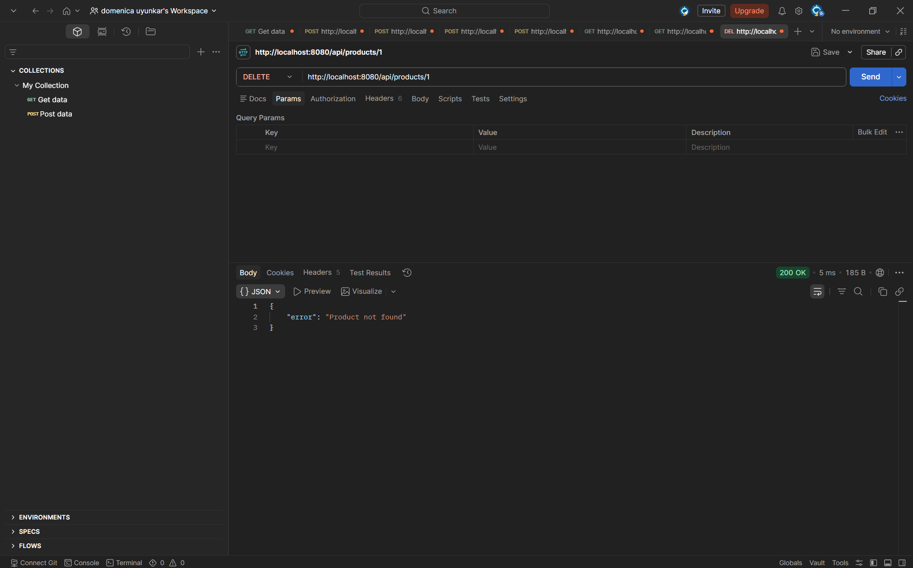

### Evidencia 11: Eliminación de un producto inexistente

Se intentó eliminar nuevamente el producto con el mismo identificador. El sistema devolvió un mensaje indicando que el producto no existe:

```http
DELETE /api/products/1
```

URL utilizada:

```text
http://localhost:8080/api/products/1
```

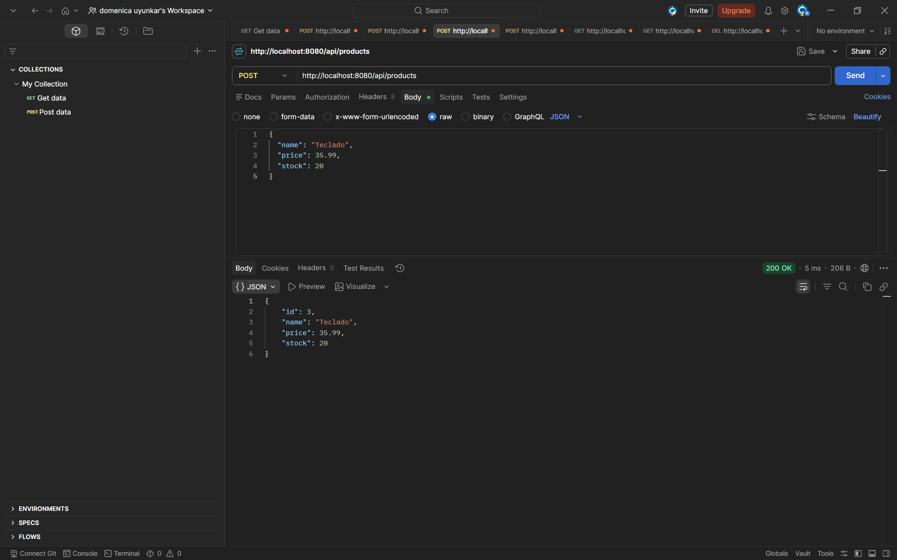

---

# Práctica 4: Servicios, lógica de negocio e inyección de dependencias

## Descripción

En esta práctica se implementó una capa de servicios para separar la lógica de negocio del controlador.

Anteriormente, `ProductsController` contenía la lista en memoria y toda la lógica necesaria para crear, consultar, actualizar y eliminar productos.

Ahora, la lógica del CRUD se encuentra en `ProductServiceImpl`, mientras que `ProductsController` solamente recibe las peticiones HTTP y delega las operaciones al servicio.

El nuevo flujo de la aplicación es:

```text
Cliente
   ↓
ProductsController
   ↓
ProductService
   ↓
ProductServiceImpl
   ↓
List<ProductModel>
   ↓
ProductMapper
   ↓
ProductResponseDto
   ↓
Cliente
```

## Estructura del módulo de productos

```text
products/
├── controllers/
│   └── ProductsController.java
├── dtos/
│   ├── CreateProductDto.java
│   ├── PartialUpdateProductDto.java
│   ├── ProductResponseDto.java
│   └── UpdateProductDto.java
├── mappers/
│   └── ProductMapper.java
├── models/
│   └── ProductModel.java
└── services/
    ├── ProductService.java
    └── ProductServiceImpl.java
```

## ProductService

La interfaz `ProductService` declara las operaciones disponibles para la gestión de productos.

```java
public interface ProductService {

    List<ProductResponseDto> findAll();

    Object findOne(Long id);

    ProductResponseDto create(CreateProductDto dto);

    Object update(Long id, UpdateProductDto dto);

    Object partialUpdate(Long id, PartialUpdateProductDto dto);

    Object delete(Long id);
}
```

La interfaz define el contrato del servicio, pero no contiene la implementación de la lógica.

## ProductServiceImpl

La clase `ProductServiceImpl` implementa la interfaz `ProductService` y contiene la lógica del CRUD de productos.

```java
@Service
public class ProductServiceImpl implements ProductService {

    private final List<ProductModel> products = new ArrayList<>();
    private Long currentId = 1L;

    @Override
    public List<ProductResponseDto> findAll() {
        return products.stream()
                .map(ProductMapper::toResponse)
                .toList();
    }

    @Override
    public Object findOne(Long id) {
        return products.stream()
                .filter(product -> product.getId().equals(id))
                .findFirst()
                .map(product -> (Object) ProductMapper.toResponse(product))
                .orElseGet(() ->
                        new ErrorResponseDto("Product not found"));
    }

    @Override
    public ProductResponseDto create(CreateProductDto dto) {

        ProductModel product = ProductMapper.toModel(dto);

        product.setId(currentId);
        currentId++;

        products.add(product);

        return ProductMapper.toResponse(product);
    }

    @Override
    public Object update(Long id, UpdateProductDto dto) {

        ProductModel product = products.stream()
                .filter(item -> item.getId().equals(id))
                .findFirst()
                .orElse(null);

        if (product == null) {
            return new ErrorResponseDto("Product not found");
        }

        product.setName(dto.getName());
        product.setPrice(dto.getPrice());
        product.setStock(dto.getStock());

        return ProductMapper.toResponse(product);
    }

    @Override
    public Object partialUpdate(
            Long id,
            PartialUpdateProductDto dto) {

        ProductModel product = products.stream()
                .filter(item -> item.getId().equals(id))
                .findFirst()
                .orElse(null);

        if (product == null) {
            return new ErrorResponseDto("Product not found");
        }

        if (dto.getName() != null) {
            product.setName(dto.getName());
        }

        if (dto.getPrice() != null) {
            product.setPrice(dto.getPrice());
        }

        if (dto.getStock() != null) {
            product.setStock(dto.getStock());
        }

        return ProductMapper.toResponse(product);
    }

    @Override
    public Object delete(Long id) {

        boolean removed = products.removeIf(
                product -> product.getId().equals(id));

        if (!removed) {
            return new ErrorResponseDto("Product not found");
        }

        return new Object() {
            public String message = "Deleted successfully";
        };
    }
}
```

En esta implementación se evidencia:

* El uso de la anotación `@Service`.
* La lista de productos almacenada en memoria.
* La generación automática de identificadores.
* El uso de `ProductMapper`.
* La implementación de los seis métodos del CRUD.
* El manejo de productos inexistentes con `ErrorResponseDto`.

### Evidencia adicional de ProductServiceImpl

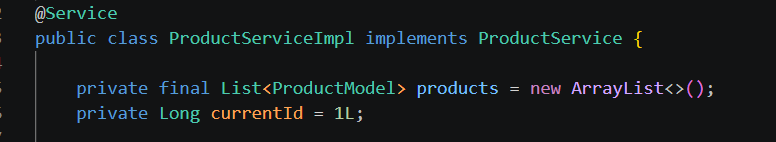

## ProductsController

El controlador ya no contiene la lista de productos ni la lógica interna del CRUD.

```java
@RestController
@RequestMapping("/products")
public class ProductsController {

    private final ProductService service;

    public ProductsController(ProductService service) {
        this.service = service;
    }

    @GetMapping
    public List<ProductResponseDto> findAll() {
        return service.findAll();
    }

    @GetMapping("/{id}")
    public Object findOne(@PathVariable Long id) {
        return service.findOne(id);
    }

    @PostMapping
    public ProductResponseDto create(
            @RequestBody CreateProductDto dto) {

        return service.create(dto);
    }

    @PutMapping("/{id}")
    public Object update(
            @PathVariable Long id,
            @RequestBody UpdateProductDto dto) {

        return service.update(id, dto);
    }

    @PatchMapping("/{id}")
    public Object partialUpdate(
            @PathVariable Long id,
            @RequestBody PartialUpdateProductDto dto) {

        return service.partialUpdate(id, dto);
    }

    @DeleteMapping("/{id}")
    public Object delete(@PathVariable Long id) {
        return service.delete(id);
    }
}
```

En el controlador se evidencia:

* La declaración de una dependencia de tipo `ProductService`.
* La inyección del servicio mediante el constructor.
* La existencia de los seis endpoints REST.
* La delegación de las operaciones al servicio.
* La ausencia de la lista en memoria.
* La ausencia de lógica CRUD dentro del controlador.

## ¿Cómo se inyecta el servicio en el controlador?

El servicio se inyecta en `ProductsController` mediante inyección de dependencias por constructor.

Primero, el controlador declara una variable de tipo `ProductService`:

```java
private final ProductService service;
```

Después, la dependencia se recibe en el constructor:

```java
public ProductsController(ProductService service) {
    this.service = service;
}
```

Spring Boot detecta que `ProductServiceImpl` implementa la interfaz `ProductService` y está anotada con `@Service`.

Por esta razón, Spring crea automáticamente una instancia de `ProductServiceImpl` y la entrega al constructor de `ProductsController`.

De esta manera, el controlador solamente recibe las peticiones HTTP y delega la lógica del CRUD al servicio.

## Diferencia entre la práctica anterior y la práctica actual

### Antes

```text
Postman
   ↓
ProductsController
   ↓
Lista de productos en memoria
```

El controlador recibía las peticiones HTTP y también ejecutaba directamente la lógica del CRUD.

### Ahora

```text
Postman
   ↓
ProductsController
   ↓
ProductService
   ↓
ProductServiceImpl
   ↓
Lista de productos en memoria
```

El controlador recibe las peticiones y delega cada operación al servicio. La lista y la lógica del CRUD ahora se encuentran en `ProductServiceImpl`.

## Conclusión

La implementación de la capa de servicios permite separar las responsabilidades de la aplicación.

`ProductsController` se encarga de recibir las peticiones HTTP, mientras que `ProductServiceImpl` administra la lógica de negocio, la generación de identificadores y el almacenamiento temporal de los productos.

Esta organización mejora la estructura del proyecto y facilita la incorporación futura de repositorios y una base de datos.
